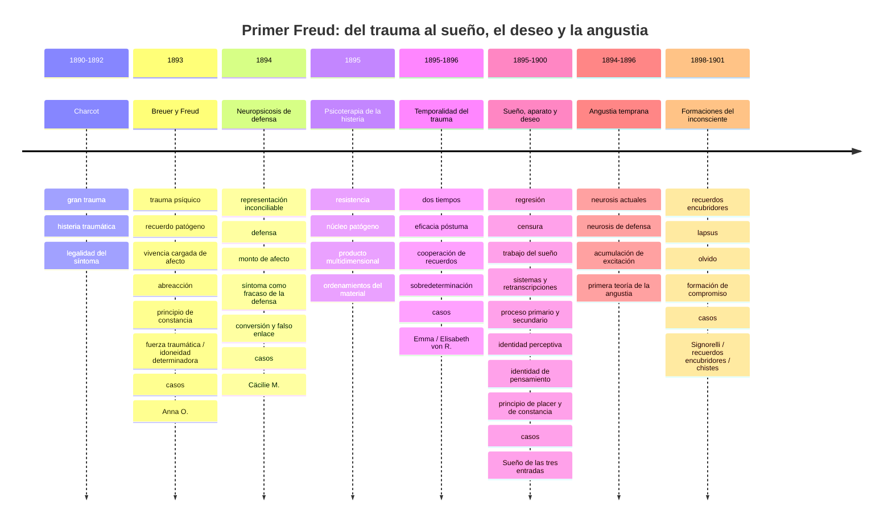
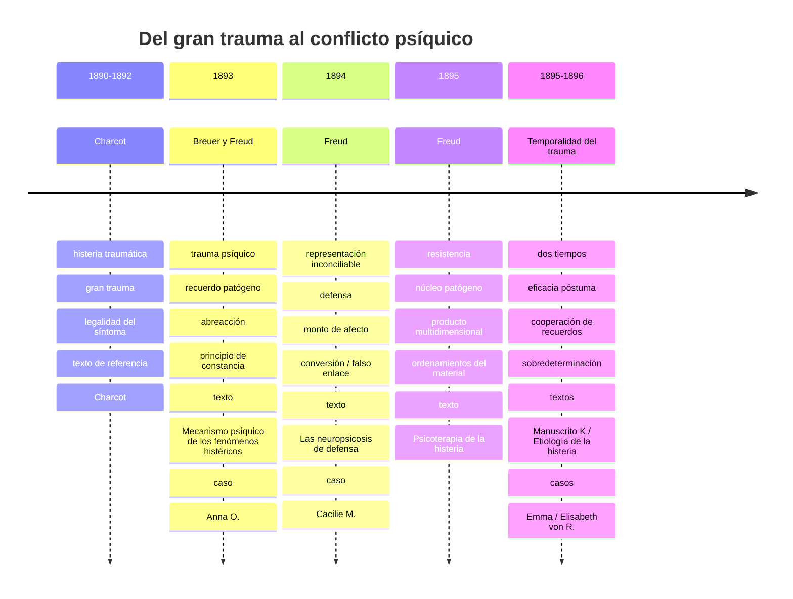
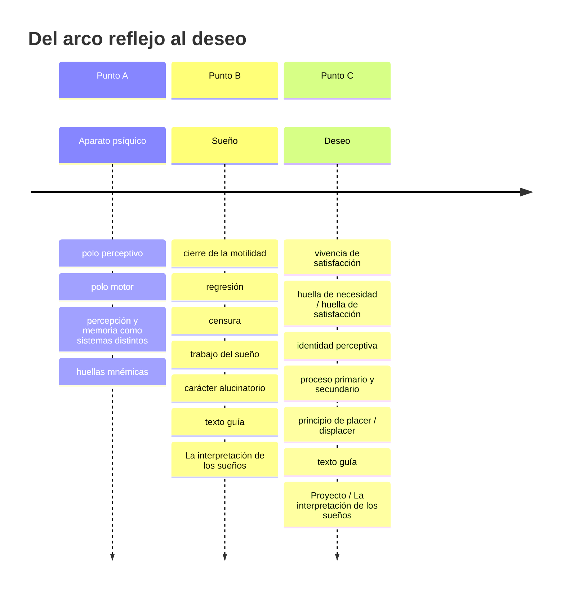

# Línea temporal del primer Freud

Antes de entrar en los siete problemas de esta parte, conviene ubicar de un vistazo cómo se va desplazando la pregunta de Freud.

Esta línea no reemplaza la lectura de los capítulos: sirve como mapa de orientación para no mezclar momentos, textos y conceptos que Freud va afinando en etapas distintas.

## Zoom: trauma y síntoma

Si se aísla solo la línea de trauma, el recorrido queda bastante claro:

### Qué conviene retener de este tramo

- **Charcot** da la legalidad de la histeria, pero todavía en clave de gran trauma.
- **Breuer y Freud** desplazan el problema hacia el recuerdo patógeno y el afecto no abreaccionado.
- **Las neuropsicosis de defensa** introducen conflicto psíquico, defensa y separación entre representación y monto de afecto.
- **Psicoterapia de la histeria** complejiza el método: resistencia, núcleo patógeno y organización estratificada del material.
- **Emma** y **Manuscrito K** complejizan la temporalidad del trauma.

## Zoom: sueño, aparato y deseo

En sueño conviene separar dos momentos, porque la cátedra no los toma como si fueran exactamente lo mismo.

### Qué conviene no mezclar

- Si te preguntan por el **carácter alucinatorio del sueño**, suele alcanzar con **A/B**:
  - percepción,
  - memoria,
  - cierre de la motilidad,
  - regresión hacia huellas.
- Si te preguntan por **deseo**, **proceso primario** o **principio de placer**, ahí sí conviene meter **C**:
  - vivencia de satisfacción,
  - identidad perceptiva,
  - deseo inconsciente.

## Cómo leer esta línea

- **Trauma y abreacción** conviene ligarlos al momento Breuer-Freud.
- **Defensa, representación inconciliable y síntoma** conviene desarrollarlos con *Las neuropsicosis de defensa*.
- **Resistencia, núcleo patógeno y producto multidimensional** conviene ligarlos a *Psicoterapia de la histeria*.
- **Dos tiempos** y **eficacia póstuma** conviene explicarlos con *Emma*.
- **Sobredeterminación** conviene bajarla mejor con *Elisabeth von R.*
- **Sueño, aparato y deseo** forman un bloque posterior donde Freud complejiza la tópica, la regresión y la lógica del proceso primario.
- **Angustia** en este momento todavía no es la segunda teoría: sigue ligada a las neurosis actuales y a la acumulación de excitación.

## Qué pregunta domina en cada tramo

- En el comienzo, la pregunta es: **¿cómo una vivencia puede seguir actuando y producir síntoma?**
- Luego pasa a ser: **¿de qué se defiende el yo y cómo se forma el síntoma?**
- Después se complejiza hacia: **¿cuándo una escena deviene traumática y por qué no alcanza una sola causa?**
- Finalmente, Freud reorganiza el problema alrededor de **sueño, deseo, aparato psíquico y angustia**.

Esta es la lógica de los capítulos que siguen.
