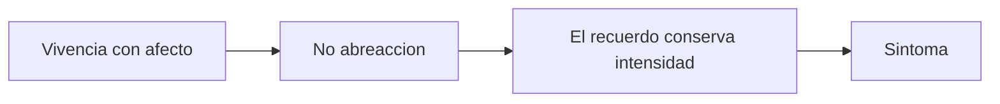

# Del trauma al conflicto psiquico

## Problema

Freud parte de la histeria traumatica de Charcot, pero desplaza el problema desde el golpe fisico hacia la representacion y el trauma psiquico.

El movimiento importante es este: la histeria deja de ser pensada como simulacion, capricho o puro accidente corporal. Freud empieza a leer el sintoma como un efecto con determinacion psiquica. Todavia no tiene armada la teoria del inconciente de 1900, pero ya esta construyendo sus condiciones: hay recuerdos que no estan disponibles para la conciencia, afectos que no se tramitaron y sintomas que dicen algo sin que el paciente lo sepa.

## Charcot

- Histeria traumatica.
- Accidente o contingencia.
- Gran trauma fisico.
- La hipnosis muestra que el sintoma puede reproducirse o suprimirse.
- Punto clave para Freud: la causa no es simplemente el golpe, sino la representacion asociada.

Charcot le ofrece a Freud un punto decisivo: la histeria tiene legalidad clinica. No es fingimiento. Pero tambien tiene un limite: su modelo se organiza alrededor del gran trauma fisico, del accidente y del peligro corporal. Freud va a tomar de ahi la importancia de la representacion, pero va a ampliar el campo hacia la histeria comun, donde no necesariamente hay un accidente unico y evidente.

## Breuer y Freud

- Anna O.
- Hipnosis para recuperar recuerdos.
- Vivencias tenidas de afecto.
- Afecto que no se desgasto con el tiempo.
- Historia de padecimiento, no un unico episodio.
- Metodo catartico: abreaccion.

Con Anna O. aparece otra escena: no se trata solo de un golpe, sino de sintomas ligados a historias, palabras, recuerdos y afectos. La hipnosis permite recuperar escenas olvidadas. Cuando el recuerdo aparece y el afecto se descarga, el sintoma puede ceder. Este es el nucleo del metodo catartico.

## Principio de constancia

El aparato busca disminuir la suma de excitacion. Si un afecto queda estrangulado y no se descarga por via motriz, palabra o asociacion, conserva intensidad y puede producir sintoma.

La abreaccion es la descarga adecuada de ese afecto. Puede ocurrir por una reaccion motriz, por la palabra o por un procesamiento asociativo. Cuando esa descarga no ocurre, el recuerdo conserva una intensidad anormal. En ese sentido, el sintoma histerico aparece como una solucion fallida: algo que no pudo tramitarse psiquicamente encuentra otra via.

## Trauma psiquico

El trauma psiquico no es simplemente un acontecimiento externo. Es una vivencia que conserva afecto y que, por no haber sido abreaccionada, sigue actuando. Por eso Freud puede decir que en la histeria comun no hay necesariamente un unico gran trauma, sino una historia de padecimiento.

Formula:

## Giro freudiano

El trauma no es solo fisico ni lineal. Freud empieza a localizar:

- conflicto psiquico;
- defensa;
- resistencia;
- sobredeterminacion;
- temporalidad retroactiva.

## Cuadro minimo

| Momento | Eje | Trauma |
|---|---|---|
| 1893 | Sintoma y abreaccion | Afecto no tramitado |
| 1894 | Defensa | Representacion inconciliable |
| 1895 | Dos tiempos | Recuerdo que cobra eficacia postuma |

## Para no confundir

No conviene usar "trauma" como palabra unica. En este tramo hay por lo menos tres usos:

- Trauma como afecto no abreaccionado.
- Trauma como conflicto con una representacion inconciliable.
- Trauma como efecto retroactivo de un recuerdo que cobra valor despues.

Esta distincion es muy importante para el parcial, porque una pregunta sobre "trauma" puede apuntar a teorico, practico o seminario.
