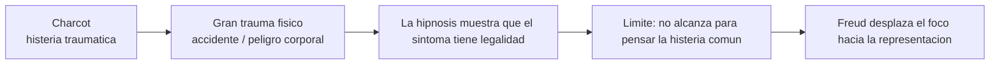
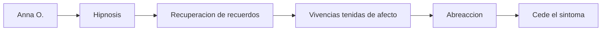
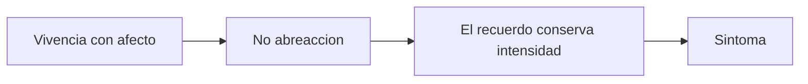
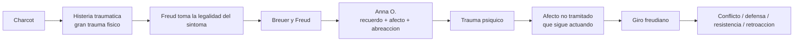

# Del trauma al conflicto psíquico

## Problema

*Freud parte de la \concept{histeria traumática} de Charcot, pero desplaza el problema desde el golpe físico hacia la \concept{representación} y el \concept{trauma psíquico}.*

**El movimiento importante es este:** la histeria deja de ser pensada como simulación, capricho o puro accidente corporal. Freud empieza a leer **el \concept{síntoma} como un efecto con determinación psíquica**. Todavía no tiene armada la teoría del \concept{inconciente} de 1900, pero ya está construyendo sus condiciones: hay recuerdos que no están disponibles para la conciencia, afectos que no se tramitaron y síntomas que dicen algo sin que el paciente lo sepa.

## Charcot

- **\concept{Histeria traumática}.**
- Accidente o contingencia.
- **Gran trauma físico.**
- La hipnosis muestra que el sintoma puede reproducirse o suprimirse.
- **Punto clave para Freud:** la causa no es simplemente el golpe, sino **la \concept{representación asociada}**.

Charcot le ofrece a Freud un punto decisivo: **la histeria tiene legalidad clínica**. No es fingimiento. Pero también tiene **un límite**: su modelo se organiza alrededor del gran trauma físico, del accidente y del peligro corporal. Freud va a tomar de ahí la importancia de la representación, pero va a ampliar el campo hacia **la histeria común**, donde no necesariamente hay un accidente único y evidente.

### Checkpoint: de Charcot al problema freudiano

## Breuer y Freud

- **Anna O.**
- Hipnosis para recuperar recuerdos.
- **Vivencias tenidas de afecto.**
- Afecto que no se desgasto con el tiempo.
- Historia de padecimiento, no un único episodio.
- **Método catártico: \concept{abreacción}.**

Con Anna O. aparece otra escena: **no se trata solo de un golpe**, sino de síntomas ligados a historias, palabras, recuerdos y afectos. La hipnosis permite recuperar escenas olvidadas. Cuando el recuerdo aparece y el afecto se descarga, el síntoma puede ceder. **Este es el núcleo del método catártico.**

### Checkpoint: Breuer y Freud

## Principio de constancia

**El aparato busca disminuir la suma de excitación.** Si un afecto queda estrangulado y no se descarga por vía motriz, palabra o asociación, conserva intensidad y puede producir síntoma.

*La \concept{abreacción} es la descarga adecuada de ese afecto.* Puede ocurrir por una reacción motriz, por la palabra o por un procesamiento asociativo. Cuando esa descarga no ocurre, el recuerdo conserva una intensidad anormal. En ese sentido, *el síntoma histérico aparece como una solución fallida*: algo que no pudo tramitarse psíquicamente encuentra otra vía.

## Trauma psiquico

*El \concept{trauma psíquico} no es simplemente un acontecimiento externo.* Es una vivencia que conserva afecto y que, por no haber sido \concept{abreaccionada}, sigue actuando. Por eso Freud puede decir que en la histeria común no hay necesariamente un único gran trauma, sino *una historia de padecimiento*.

Formula:

## Giro freudiano

**El trauma no es solo físico ni lineal.** Freud empieza a localizar:

- \concept{conflicto psíquico};
- defensa;
- resistencia;
- \concept{sobredeterminación};
- temporalidad retroactiva.

## Cuadro minimo

| Momento | Eje | Trauma |
|---|---|---|
| 1893 | Síntoma y abreacción | Afecto no tramitado |
| 1894 | Defensa | \concept{Representación inconciliable} |
| 1895 | Dos tiempos | Recuerdo que cobra \concept{eficacia póstuma} |

## Para no confundir

**No conviene usar "trauma" como palabra única.** En este tramo hay por lo menos tres usos:

- Trauma como afecto no abreaccionado.
- Trauma como conflicto con una \concept{representación inconciliable}.
- Trauma como efecto retroactivo de un recuerdo que cobra valor después.

Esta distinción es muy importante para el parcial, porque una pregunta sobre "trauma" puede apuntar a teórico, práctico o seminario.

## Diagrama integrador

