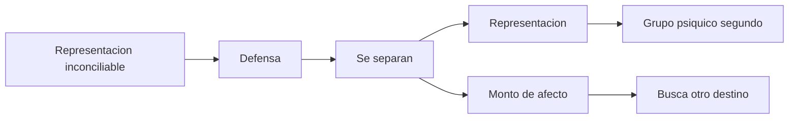
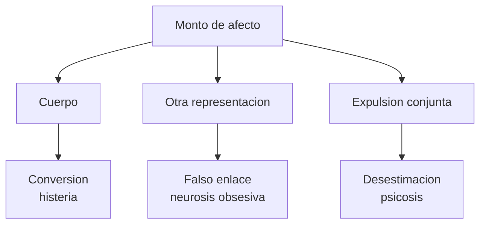
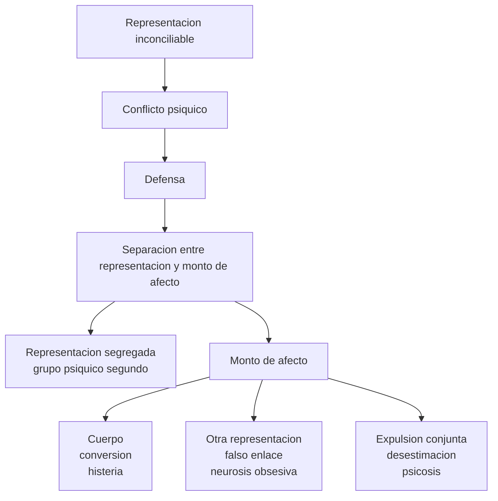
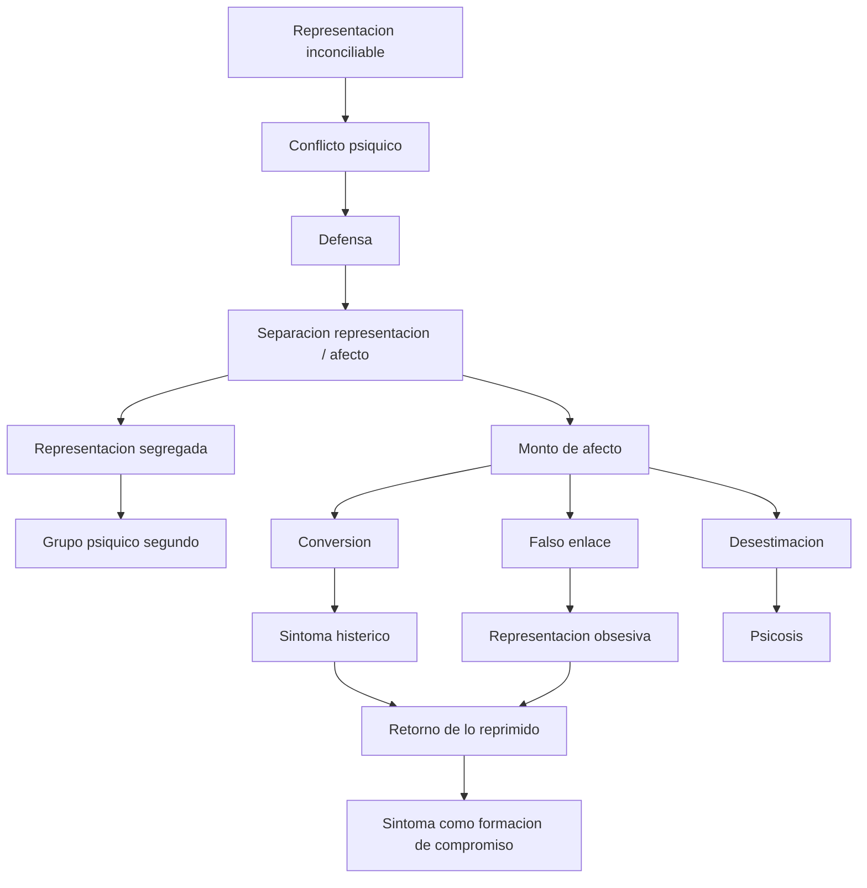

# Defensa, síntoma y retorno

## Problema

*En Las neuropsicosis de defensa, Freud explica el \concept{síntoma} por un \concept{conflicto psíquico}.* El yo encuentra una \concept{representación inconciliable} e intenta tratarla como no acontecida, pero fracasa.

**Este texto produce un desplazamiento central:** **la escisión de conciencia ya no es primaria, sino secundaria**. No es que primero haya una conciencia escindida y luego aparezca el síntoma; **la escisión se produce como consecuencia de una defensa**. El yo quiere defenderse de una representación insoportable, pero no puede borrarla sin resto.

## Hipotesis auxiliar

*Freud separa:*

- **\concept{representación};**
- **\concept{monto de afecto}.**

La representación puede quedar segregada de la conciencia. **El monto de afecto debe encontrar otro destino.**

**Esta separación permite pensar distintas neurosis.** La representación queda fuera del comercio conciente y forma **un \concept{grupo psíquico segundo}**. El monto de afecto, en cambio, no desaparece: se desplaza, se transpone o se liga a otra cosa.

### Checkpoint: hipotesis auxiliar

## Destinos

| Destino | Operacion | Cuadro |
|---|---|---|
| Cuerpo | Conversion | Histeria |
| Otra representacion | Falso enlace | Neurosis obsesiva |
| Expulsion conjunta | Desestimacion | Psicosis |

## Histeria

En la histeria, **el monto de afecto pasa al cuerpo**. Freud llama \concept{conversión} a esta transposición. **El síntoma corporal no es arbitrario:** conserva algún nexo simbólico o asociativo con la representación inconciliable. Por eso se puede leer. **El cuerpo histérico no es puro cuerpo orgánico:** es cuerpo tomado por lenguaje e historia.

Ver también: [Caso Cäcilie M.](../03-apendice-casos/01-caso-cecilie-m.md), [Caso Elisabeth von R.](../03-apendice-casos/03-caso-elisabeth-von-r.md)

## Neurosis obsesiva

En la neurosis obsesiva, si no hay conversión, **el monto de afecto se enlaza con otra representación**. Esa nueva representación no era en sí misma inconciliable, pero se vuelve obsesiva porque recibe un afecto que no le pertenecía. **Freud llama a esto \concept{falso enlace}.**

Ver también: [Caso Emma](../03-apendice-casos/02-caso-emma.md)

## Psicosis

En la psicosis, según este primer esquema, **el yo desestima la representación insoportable junto con su monto de afecto**. No aparece la misma formación sustitutiva neurótica. La cátedra no parece profundizar este destino en el primer parcial, pero conviene ubicarlo como contraste.

## Sintoma

*El sintoma es:*

- formacion sustitutiva;
- testimonio del conflicto;
- retorno deformado de lo reprimido;
- resultado del fracaso de la defensa.

*La defensa tiene éxito y fracasa a la vez.* Tiene éxito porque la representación inconciliable queda fuera de la conciencia. Fracasa porque lo expulsado retorna bajo forma de síntoma. Por eso *el síntoma es una \concept{formación de compromiso}*: satisface parcialmente la defensa y, al mismo tiempo, conserva algo de lo reprimido.

### Checkpoint: destinos del afecto

## Fórmula canónica de las neuropsicosis de defensa

*\concept{Representación inconciliable} -> conflicto -> defensa -> separación representación/monto de afecto -> sustitución -> síntoma.*

Desplegada en pasos:

1. aparece una **\concept{representación inconciliable}** para el yo;
2. se produce **\concept{conflicto psíquico}**;
3. el yo pone en marcha la **\concept{defensa}**;
4. la defensa separa **representación** y **\concept{monto de afecto}**;
5. la representación queda segregada y forma un **\concept{grupo psíquico segundo}**;
6. el monto de afecto busca otro destino:
   histeria por **conversión**, neurosis obsesiva por **falso enlace**, o desestimación en la psicosis;
7. lo expulsado retorna bajo una **formación sustitutiva**;
8. ese retorno aparece como **\concept{síntoma}**.

Diagrama:

## Cuadro de parcial

| Concepto | Definición breve |
|---|---|
| Representación inconciliable | Representación incompatible con el yo |
| Defensa | Operación que intenta apartarla de la conciencia |
| Monto de afecto | Carga afectiva separable de la representación |
| Grupo psíquico segundo | Antecedente conceptual del inconciente |
| Síntoma | Sustituto y retorno deformado |

## Diagrama integrador

## Casos emblemáticos de este tramo

- [Cäcilie M.](../03-apendice-casos/01-caso-cecilie-m.md): nexo simbólico entre afrenta psíquica y síntoma corporal.
- [Emma](../03-apendice-casos/02-caso-emma.md): defensa, formación del síntoma y articulación entre escenas.
- [Elisabeth von R.](../03-apendice-casos/03-caso-elisabeth-von-r.md): sobredeterminación, resistencia y lectura analítica del síntoma.
