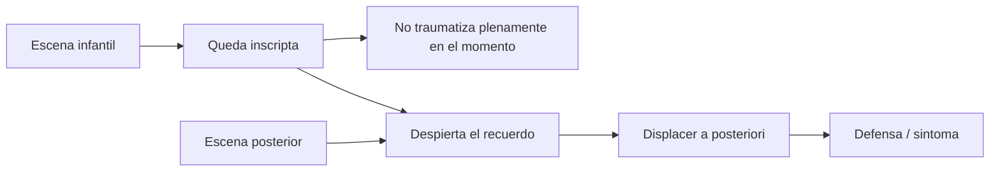
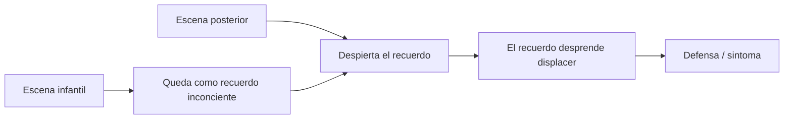
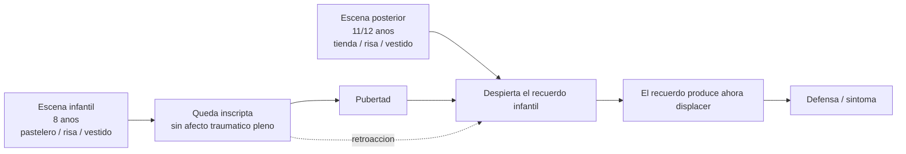
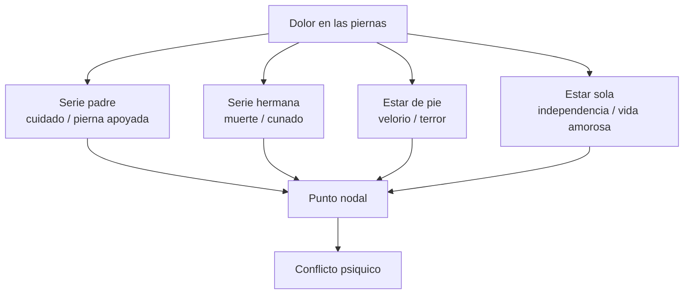
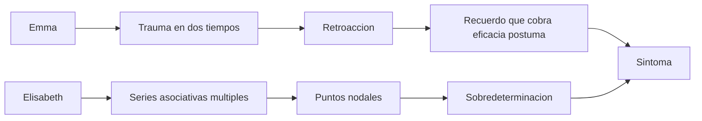

# Temporalidad y sobredeterminación

## Problema

*El síntoma freudiano no se explica por una causa única ni por una temporalidad lineal.*

Este capítulo junta dos problemas que la cátedra remarca: **por un lado, el trauma en dos tiempos; por otro, la \concept{sobredeterminación} del síntoma**. Ambos rompen con una causalidad simple. **Un síntoma no se explica por "un hecho" ni por una secuencia cronológica directa.**

## Emma

*Emma muestra el trauma en dos tiempos:*

1. Una escena infantil ligada a sexualidad, risa y vestido.
2. Una escena posterior que despierta el recuerdo.

La vivencia inicial no produce todo su efecto en el momento. *El recuerdo, luego de la pubertad, desprende displacer. Por eso hay \concept{eficacia póstuma}.*

**El punto decisivo es que el trauma no está completo en el primer tiempo.** La escena infantil solo se vuelve traumática cuando una escena posterior la despierta y la resignifica. La pubertad introduce una nueva posibilidad de desprendimiento sexual, y entonces el recuerdo produce un afecto que la vivencia no había producido en su momento.

### Checkpoint: Emma

## Vivencia y recuerdo

| Vivencia | Recuerdo |
|---|---|
| Acontecimiento vivido | Reinscripcion psiquica |
| Puede no ser traumática en el momento | Puede producir efecto a posteriori |
| Cronológica | Lógica y retroactiva |

Formula:

Esto permite entender por qué el síntoma de Emma no deriva de una escena sola. **La eficacia está en el encadenamiento.**

Diagrama de Emma:

## Elisabeth von R.

*Elisabeth muestra \concept{sobredeterminación}:*

- dolor de piernas;
- cuidado del padre;
- muerte de la hermana;
- caminar, estar de pie, estar sola;
- deseo de vida amorosa propia;
- lugar de cuidadora.

**El síntoma condensa varias cadenas.** No es cuerpo extraño, está infiltrado en la trama psíquica.

Diagrama de Elisabeth:

En Elisabeth, **el dolor de piernas no se explica por una única escena**. Freud va siguiendo series asociativas: el cuidado del padre, la muerte de la hermana, escenas de estar de pie, caminar, quedarse sola. Cada serie aporta un sentido parcial. **El síntoma es un punto de convergencia.**

### Checkpoint: Elisabeth

## Ordenamientos

| Ordenamiento | Funcion |
|---|---|
| Lineal cronológico | Organiza recuerdos dentro de un tema |
| Concéntrico | Ubica estratos de resistencia alrededor del núcleo patógeno |
| Por contenido de pensamiento | Sigue hilos lógicos y puntos nodales |

**La \concept{sobredeterminación} se ve especialmente en el tercer ordenamiento.** El análisis no avanza como una línea recta, sino **por cadenas que se cruzan**.

## Formula

*El síntoma tiene determinación múltiple: varias cadenas asociativas convergen en puntos nodales.*

## Diferencia útil

| Emma | Elisabeth |
|---|---|
| Sirve para pensar dos tiempos y retroacción | Sirve para pensar sobredeterminación y ordenamientos |
| Nexo entre escenas | Nexo entre series asociativas |
| Recuerdo cobra eficacia póstuma | Síntoma condensa varios sentidos |

## Diagrama integrador

Casos guia para ampliar:

- [Caso Emma](../05-apendice-casos/01-caso-emma.md)
- [Caso Elisabeth von R.](../05-apendice-casos/02-caso-elisabeth-von-r.md)
