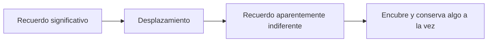
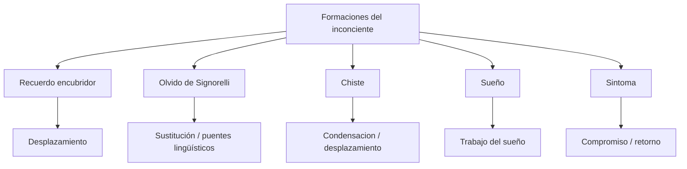

# Formaciones del inconciente

## Problema

**Freud extiende la lógica del inconciente a fenómenos normales:** sueños, chistes, lapsus, olvidos, errores y recuerdos encubridores.

**Este movimiento es enorme.** Lo inconciente ya no aparece solo en la enfermedad. También aparece en la vida cotidiana. **Las fallas, rarezas y ocurrencias normales muestran que la conciencia no gobierna todo el psiquismo.**

## Idea central

*Estos fenómenos tienen sentido.* No son simples fallas ni azar: *son sustituciones, desplazamientos y \concept{formaciones de compromiso}.*

La clave es que **no se interpretan por una voluntad conciente**. El sujeto puede querer recordar un nombre y no poder; puede conservar un recuerdo infantil aparentemente indiferente; puede hacer un chiste sin saber del todo por qué produce efecto. **En todos esos casos, algo se dice desplazado.**

## Recuerdos encubridores

- Memoria tendenciosa.
- Desplazamiento.
- Recuerdo indiferente que sustituye a uno significativo.
- Los recuerdos infantiles son elaboraciones posteriores.

*El \concept{recuerdo encubridor} conserva algo porque encubre otra cosa.* Su valor no está en el contenido manifiesto, sino en el enlace con un recuerdo significativo que no aparece directamente. *El \concept{desplazamiento} mueve el acento psíquico hacia un elemento indiferente.*

Por eso Freud sostiene que **los recuerdos infantiles no son copia fiel de la infancia**. Son elaboraciones posteriores. Muchas veces nos vemos en la escena desde afuera, como si la memoria fuese una imagen armada después.

### Tesis fuerte

**Todo recuerdo de infancia es encubridor** no significa que toda la infancia sea falsa, sino que **todo recuerdo infantil llega ya trabajado** por selecciones, desplazamientos y resignificaciones posteriores. La memoria no funciona como un archivo neutral. Conserva una escena, pero la conserva en una forma que ya es compromiso entre lo que puede aparecer y lo que no puede aparecer directamente.

Por eso Freud no opone simplemente:

- recuerdo verdadero;
- recuerdo falso.

La oposición más útil es otra:

- contenido manifiesto del recuerdo;
- serie latente que ese recuerdo encubre y conserva.

### Qué conviene desarrollar

Si una consigna pide fundamentar esta tesis, conviene nombrar:

- que la memoria infantil **no es copia fiel**;
- que el recuerdo se arma como **elaboración posterior**;
- que el mecanismo fuerte es el **desplazamiento**;
- que un detalle aparentemente indiferente puede quedar **sobreinvestido**;
- que el recuerdo **encubre y conserva** a la vez.

### Caso guía: cajón / canasta

El recuerdo del cajón o la canasta le sirve a Freud para mostrar esta lógica con material concreto. Lo que aparece con nitidez no es “lo importante” en sentido directo, sino una escena desplazada que se vuelve interpretable al articularse con:

- la ausencia de la madre;
- la desaparición de la niñera;
- la intervención del hermano;
- la curiosidad sexual infantil.

Ver también: [Recuerdos encubridores](../03-apendice-casos/05-recuerdos-encubridores.md)

### Checkpoint: recuerdo encubridor

## Olvido de nombres propios

- Olvido de nombre propio.
- Nombres sustitutivos.
- Puentes lingüísticos.
- Asociaciones extrínsecas.
- **\concept{Formación de compromiso}.**

**El olvido de nombres propios no es un vacío puro de memoria.** El nombre olvidado queda arrastrado por una cadena asociativa ligada a temas reprimidos. **Los nombres sustitutivos no son azarosos:** conservan restos fonéticos o lingüísticos del nombre buscado y del tema reprimido.

El caso de **Signorelli** es el ejemplo clásico porque permite ver con nitidez:

- el olvido del nombre buscado;
- la aparición de nombres sustitutivos;
- los puentes fonéticos y asociativos;
- el nexo con un tema que Freud preferiría no desarrollar de manera directa.

*\concept{Asociación extrínseca}* significa que el enlace puede no depender del sentido principal. Puede apoyarse en sonidos, fragmentos, traducciones, nombres o detalles laterales.

### Checkpoint: olvido de nombres propios

## Chiste

Mecanismos principales:

- \concept{condensación};
- desplazamiento;
- doble sentido;
- literalidad.

Ejemplos:

- famillionario;
- becerro de oro;
- baño del judío.

En el chiste famillionario, **dos cadenas verbales se condensan en una palabra mixta**. En el chiste del baño, el efecto depende de una literalización y un desplazamiento. **El chiste muestra que el inconciente trabaja con palabras, sonidos y desplazamientos de acento.**

## Comparacion

| Formacion | Mecanismo fuerte |
|---|---|
| Recuerdo encubridor | Desplazamiento |
| Signorelli | Sustitución y puentes lingüísticos |
| Chiste | Condensacion/desplazamiento |
| Sueño | Trabajo del sueño |
| Sintoma | Formación de compromiso y retorno |

## Puente con el sueño

**Las formaciones del inconciente preparan el camino para entender el sueño.** En todas hay sustitución, desplazamiento y sentido. **El sueño será la vía privilegiada** porque permite ver con más claridad las operaciones del inconciente.

## Diagrama integrador

Casos guia para ampliar:

- [Caso Signorelli](../03-apendice-casos/04-caso-signorelli.md)
- [Recuerdos encubridores](../03-apendice-casos/05-recuerdos-encubridores.md)
- [Chistes](../03-apendice-casos/06-chistes.md)
