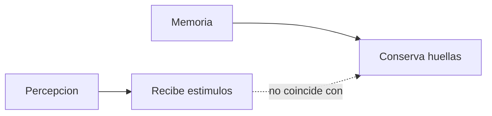
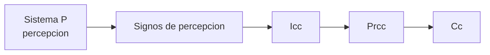
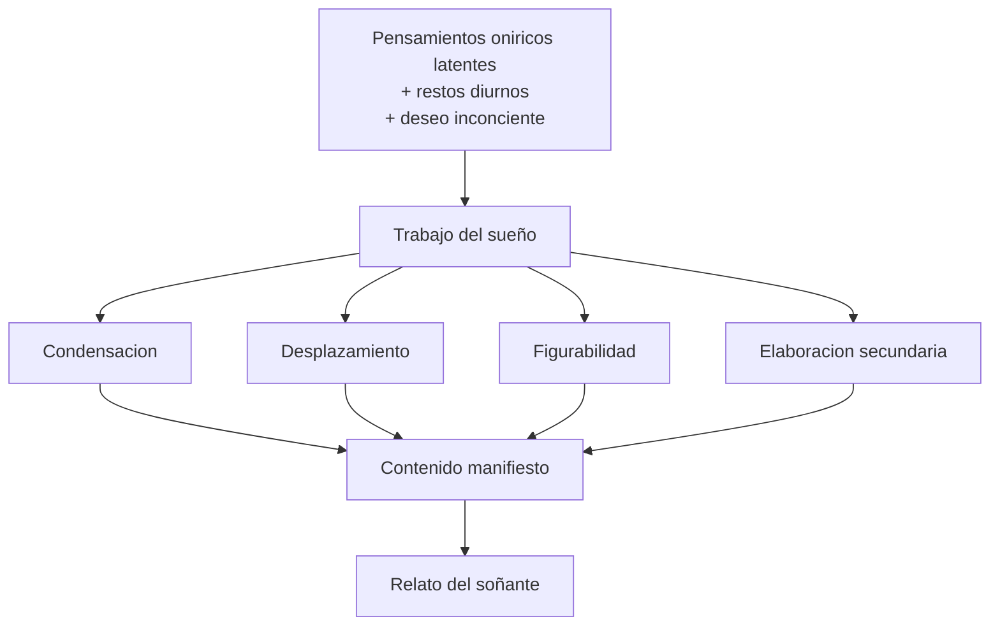
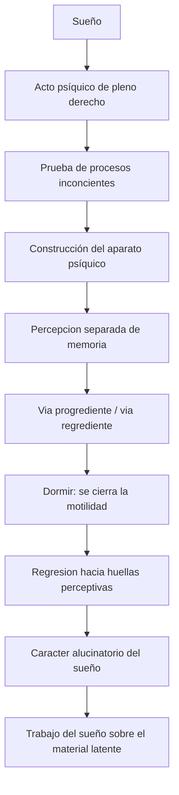

# Sueño y aparato psíquico

## Problema

*Freud usa el sueño para construir una primera teoría del psiquismo.*

En teóricos, el interés no es solo interpretar sueños. **El sueño le permite a Freud demostrar que hay procesos psíquicos inconcientes y construir un modelo del aparato.** Si durante el dormir la conciencia está disminuida, pero aun así se producen sueños con sentido, entonces **lo psíquico no puede reducirse a la conciencia**.

## Sueño

*El sueño es:*

- acto psíquico de pleno derecho;
- formación del inconciente;
- cumplimiento de deseo;
- guardián del dormir;
- vía regia al inconciente;
- relato interpretable.

*El objeto del psicoanálisis no es el sueño "puro", sino su relato.* El relato ya está ordenado y filtrado, pero es el material disponible para asociar. *Interpretar un sueño no significa traducirlo con un diccionario simbólico, sino producir asociaciones elemento por elemento.*

## Aparato psíquico

*Freud parte del arco reflejo:*

Estímulo -> polo perceptivo -> polo motor -> descarga.

Pero agrega **sistemas de huellas** entre percepción y motilidad.

Diagrama del arco reflejo:

Diagrama del aparato:

*Esquema clásico del "peine": polo perceptivo, series de huellas mnémicas, sistemas psíquicos y polo motor.*

**El arco reflejo simple no alcanza** porque no explica memoria, deseo ni sueño. Freud necesita un aparato que pueda conservar huellas, asociarlas y permitir recorridos no lineales de la excitación.

### Checkpoint: del arco reflejo al aparato

## Percepcion y memoria

- **Percepción recibe estímulos.**
- **Memoria conserva huellas.**
- **No pueden ser el mismo sistema.**
- **La huella mnémica es una alteración permanente de un sistema.**

Si el mismo sistema percibiera y conservara huellas, quedaría saturado. Por eso Freud separa funciones: **el sistema perceptivo recibe, pero no conserva; los sistemas de memoria conservan, pero no perciben directamente**.

### Checkpoint: percepcion y memoria

## Regresion

En la vigilia, la excitación va hacia la motilidad. En el dormir, **la motilidad se cierra**. La excitación retorna hacia huellas cercanas a la percepción. **Eso explica el carácter alucinatorio del sueño.**

El sueño parece percepción porque la excitación vuelve hacia el polo perceptivo. **No se descarga en acción, sino en imagen.** Esta es la vía regrediente. Por eso el sueño tiene carácter alucinatorio: **se vive como presente y real**.

Regresion en el sueño:

*Durante el dormir se cierra la motilidad y la excitación regresa hacia el polo perceptivo: por eso el sueño tiene carácter alucinatorio.*

### Tipos de regresión

| Tipo | Idea de trabajo |
|---|---|
| Tópica | La excitación vuelve hacia sistemas anteriores del aparato |
| Temporal | Retorna a lo infantil o fundante, no necesariamente a una infancia literal |
| Formal | Vuelve a modos más arcaicos de figuración y asociación: imagen, similitud, contigüidad |

Esto ayuda a no reducir la regresión a un único sentido. **En el sueño hay un retorno hacia sistemas anteriores, pero también hacia modos de funcionamiento más primitivos y hacia lo infantil como núcleo del deseo.**

## Carta 52

*\concept{Carta 52} permite pensar el aparato como serie de transcripciones:*

| Sistema | Rasgo |
|---|---|
| Sistema P | Percepción, ligado a conciencia, no deja huella |
| Signos de percepción | Primera transcripción, asociación por simultaneidad |
| Icc | Segunda transcripción, inasequible a conciencia |
| Prcc | Tercera transcripción, ligada a palabras |

La idea no es pensar compartimentos fijos, sino **transcripciones sucesivas**. Un mismo material psíquico no pasa intacto de un sistema a otro: **se reinscribe**.

Esquema:

Puntos finos:

- los **signos de percepción** son huellas muy próximas al polo perceptivo;
- no conviene confundirlos sin más con el Icc ya constituido;
- su asociación privilegiada es por **simultaneidad**;
- el Prcc introduce el enlace con **palabras** y la posibilidad de relato.

### Cómo se enlaza esto con el sueño

| Momento | Sistema o zona que conviene ubicar |
|---|---|
| Restos diurnos y pensamientos latentes | Prcc |
| Deseo inconciente que aporta fuerza | Icc |
| Trabajo del sueño sobre ese material | Frontera entre sistemas, bajo censura |
| Contenido manifiesto ya desfigurado | Cc, como relato recordado |

Esto sirve para no mezclar niveles. **El sueño no sale “listo” del inconciente**: se arma a partir de la articulación entre restos diurnos, pensamientos latentes, deseo inconciente y censura.

## Instancias y censura

Freud introduce también una oposición útil para pensar el sueño:

- una **instancia criticadora**;
- una **instancia criticada**.

No hace falta fijarlas de manera rígida como si fueran entidades cerradas. Lo importante es que **el sueño resulta del compromiso** entre un material deseante y una instancia que lo censura o lo deforma.

Orientación útil:

- el **deseo inconciente** se piensa del lado del Icc;
- los **pensamientos latentes** y restos diurnos suelen quedar más cerca del Prcc;
- la **censura** opera en la frontera entre sistemas;
- el contenido manifiesto llega a la conciencia ya desfigurado.

## Trabajo del sueño

*Operaciones:*

1. \concept{Condensación}.
2. \concept{Desplazamiento}.
3. \concept{Figurabilidad}.
4. \concept{Elaboración secundaria}.

*Interpretar es desandar el trabajo del sueño.*

Esquema:

Secuencia orientativa:

1. en el Prcc quedan **restos diurnos** y pensamientos que siguen activos;
2. un **deseo inconciente** del Icc aporta la fuerza impulsora;
3. la **censura** obliga a desfigurar ese material;
4. el trabajo del sueño lo vuelve imagen, desplazamiento, condensación y relato;
5. lo que llega a la conciencia es el **contenido manifiesto**, no los pensamientos latentes en bruto.

### Tres modos de censura

| Modo | Función |
|---|---|
| Omisión | Algo queda directamente fuera del contenido manifiesto |
| Alusión | Lo censurado aparece de manera indirecta |
| Desplazamiento del acento psíquico | Lo importante aparece como secundario y lo secundario toma relieve |

La censura no borra simplemente: **desfigura**. Por eso el sueño puede parecer absurdo, mínimo o lateral justo en los puntos donde más trabaja algo importante.

### Modos de la condensación

| Modo | Idea breve |
|---|---|
| Omisión | Algunos elementos latentes no aparecen directamente |
| Fragmentación | Aparece una parte o fragmento en lugar de una totalidad |
| Fusión | Varios elementos se reúnen en una figura o formación mixta |

Ejemplos orientativos:

- **omisión**: una cadena latente no aparece de forma directa en el relato;
- **fragmentación**: queda un detalle suelto que representa una escena más amplia;
- **fusión**: varias personas o ideas confluyen en una sola figura onírica.

### Modos del desplazamiento

| Modo | Idea breve |
|---|---|
| Descentramiento del acento psíquico | Lo importante queda en segundo plano |
| Alusión | El sueño bordea el punto conflictivo sin nombrarlo de frente |
| Asociación extrínseca | El enlace se arma por sonido, detalle lateral o puente verbal |

Ejemplos orientativos:

- **descentramiento**: un detalle mínimo toma relieve y oculta el núcleo;
- **alusión**: algo delicado aparece insinuado, no dicho directamente;
- **asociación extrínseca**: el nexo no depende del sentido principal, sino de una cercanía verbal o fonética.

## Formula de parcial

*El sueño es alucinatorio* porque, cerrado el polo motor durante el dormir, la excitación impulsada por el \concept{deseo inconciente} regresa hacia huellas perceptivas. *El aparato no actúa: figura.*

## Diagrama integrador

Caso guia para ampliar:

- [Sueño de las tres entradas de teatro](../03-apendice-casos/07-sueno-tres-entradas.md)
