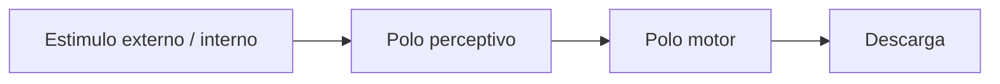
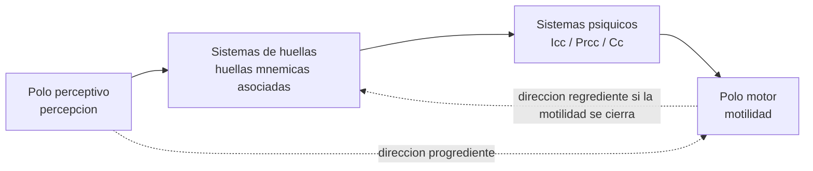
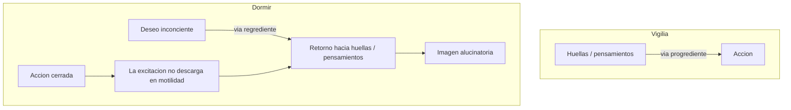
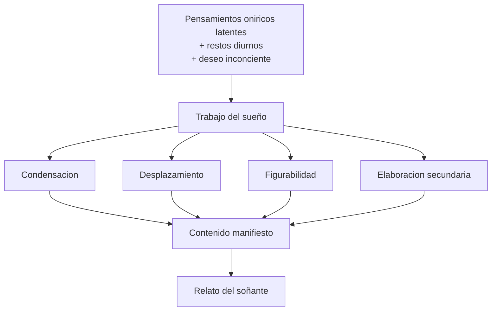

# Sueno y aparato psiquico

## Problema

Freud usa el sueño para construir una primera teoria del psiquismo.

En teoricos, el interes no es solo interpretar sueños. El sueño le permite a Freud demostrar que hay procesos psiquicos inconcientes y construir un modelo del aparato. Si durante el dormir la conciencia esta disminuida, pero aun asi se producen sueños con sentido, entonces lo psiquico no puede reducirse a la conciencia.

## Sueño

El sueño es:

- acto psiquico de pleno derecho;
- formacion del inconciente;
- cumplimiento de deseo;
- guardian del dormir;
- via regia al inconciente;
- relato interpretable.

El objeto del psicoanalisis no es el sueño "puro", sino su relato. El relato ya esta ordenado y filtrado, pero es el material disponible para asociar. Interpretar un sueño no significa traducirlo con un diccionario simbolico, sino producir asociaciones elemento por elemento.

## Aparato psiquico

Freud parte del arco reflejo:

Estimulo -> polo perceptivo -> polo motor -> descarga.

Pero agrega sistemas de huellas entre percepcion y motilidad.

Diagrama del arco reflejo:

Diagrama del aparato:

El arco reflejo simple no alcanza porque no explica memoria, deseo ni sueño. Freud necesita un aparato que pueda conservar huellas, asociarlas y permitir recorridos no lineales de la excitacion.

## Percepcion y memoria

- Percepcion recibe estimulos.
- Memoria conserva huellas.
- No pueden ser el mismo sistema.
- La huella mnemica es una alteracion permanente de un sistema.

Si el mismo sistema percibiera y conservara huellas, quedaria saturado. Por eso Freud separa funciones: el sistema perceptivo recibe, pero no conserva; los sistemas de memoria conservan, pero no perciben directamente.

## Regresion

En la vigilia, la excitacion va hacia la motilidad. En el dormir, la motilidad se cierra. La excitacion retorna hacia huellas cercanas a la percepcion. Eso explica el caracter alucinatorio del sueño.

El sueño parece percepcion porque la excitacion vuelve hacia el polo perceptivo. No se descarga en accion, sino en imagen. Esta es la via regrediente. Por eso el sueño tiene caracter alucinatorio: se vive como presente y real.

Regresion en el sueño:

## Carta 52

Carta 52 permite pensar el aparato como serie de transcripciones:

| Sistema | Rasgo |
|---|---|
| Sistema P | Percepcion, ligado a conciencia, no deja huella |
| Signos de percepcion | Primera transcripcion, asociacion por simultaneidad |
| Icc | Segunda transcripcion, inasequible a conciencia |
| Prcc | Tercera transcripcion, ligada a palabras |

## Trabajo del sueño

Operaciones:

1. Condensacion.
2. Desplazamiento.
3. Figurabilidad.
4. Elaboracion secundaria.

Interpretar es desandar el trabajo del sueño.

Esquema:

## Formula de parcial

El sueño es alucinatorio porque, cerrado el polo motor durante el dormir, la excitacion impulsada por el deseo inconciente regresa hacia huellas perceptivas. El aparato no actua: figura.
