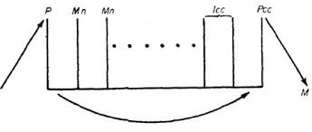
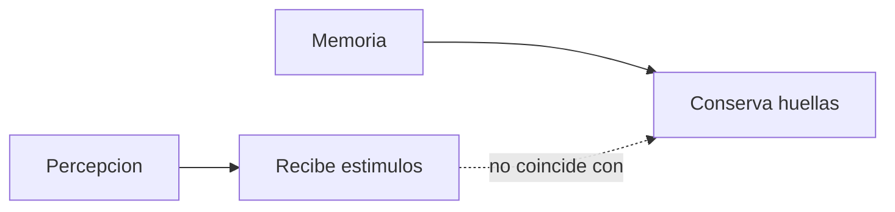
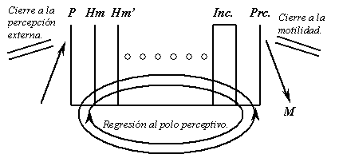
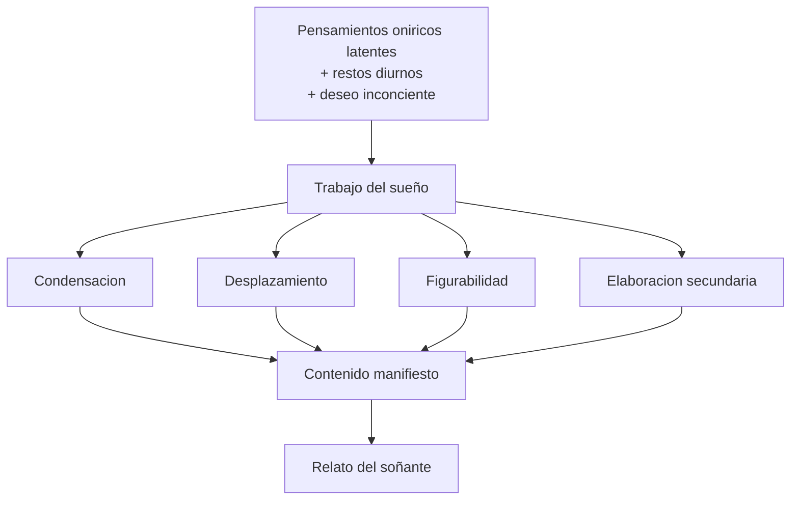
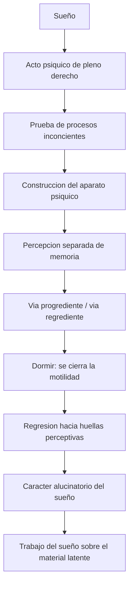

# Sueño y aparato psíquico

## Problema

*Freud usa el sueño para construir una primera teoría del psiquismo.*

En teóricos, el interés no es solo interpretar sueños. **El sueño le permite a Freud demostrar que hay procesos psíquicos inconcientes y construir un modelo del aparato.** Si durante el dormir la conciencia está disminuida, pero aun así se producen sueños con sentido, entonces **lo psíquico no puede reducirse a la conciencia**.

## Sueño

*El sueño es:*

- acto psíquico de pleno derecho;
- formación del inconciente;
- cumplimiento de deseo;
- guardián del dormir;
- vía regia al inconciente;
- relato interpretable.

*El objeto del psicoanálisis no es el sueño "puro", sino su relato.* El relato ya está ordenado y filtrado, pero es el material disponible para asociar. *Interpretar un sueño no significa traducirlo con un diccionario simbólico, sino producir asociaciones elemento por elemento.*

## Aparato psiquico

*Freud parte del arco reflejo:*

Estímulo -> polo perceptivo -> polo motor -> descarga.

Pero agrega **sistemas de huellas** entre percepción y motilidad.

Diagrama del arco reflejo:

Diagrama del aparato:

*Esquema clásico del "peine": polo perceptivo, series de huellas mnémicas, sistemas psíquicos y polo motor.*

**El arco reflejo simple no alcanza** porque no explica memoria, deseo ni sueño. Freud necesita un aparato que pueda conservar huellas, asociarlas y permitir recorridos no lineales de la excitación.

### Checkpoint: del arco reflejo al aparato

## Percepcion y memoria

- **Percepción recibe estímulos.**
- **Memoria conserva huellas.**
- **No pueden ser el mismo sistema.**
- **La huella mnémica es una alteración permanente de un sistema.**

Si el mismo sistema percibiera y conservara huellas, quedaría saturado. Por eso Freud separa funciones: **el sistema perceptivo recibe, pero no conserva; los sistemas de memoria conservan, pero no perciben directamente**.

### Checkpoint: percepcion y memoria

## Regresion

En la vigilia, la excitación va hacia la motilidad. En el dormir, **la motilidad se cierra**. La excitación retorna hacia huellas cercanas a la percepción. **Eso explica el carácter alucinatorio del sueño.**

El sueño parece percepción porque la excitación vuelve hacia el polo perceptivo. **No se descarga en acción, sino en imagen.** Esta es la vía regrediente. Por eso el sueño tiene carácter alucinatorio: **se vive como presente y real**.

Regresion en el sueño:

*Durante el dormir se cierra la motilidad y la excitación regresa hacia el polo perceptivo: por eso el sueño tiene carácter alucinatorio.*

## Carta 52

*\concept{Carta 52} permite pensar el aparato como serie de transcripciones:*

| Sistema | Rasgo |
|---|---|
| Sistema P | Percepción, ligado a conciencia, no deja huella |
| Signos de percepción | Primera transcripción, asociación por simultaneidad |
| Icc | Segunda transcripción, inasequible a conciencia |
| Prcc | Tercera transcripción, ligada a palabras |

## Trabajo del sueño

*Operaciones:*

1. \concept{Condensación}.
2. \concept{Desplazamiento}.
3. \concept{Figurabilidad}.
4. \concept{Elaboración secundaria}.

*Interpretar es desandar el trabajo del sueño.*

Esquema:

## Formula de parcial

*El sueño es alucinatorio* porque, cerrado el polo motor durante el dormir, la excitación impulsada por el \concept{deseo inconciente} regresa hacia huellas perceptivas. *El aparato no actúa: figura.*

## Diagrama integrador

