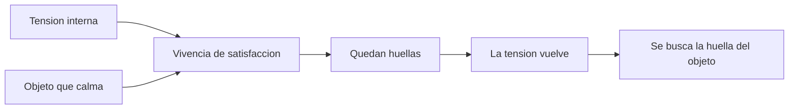
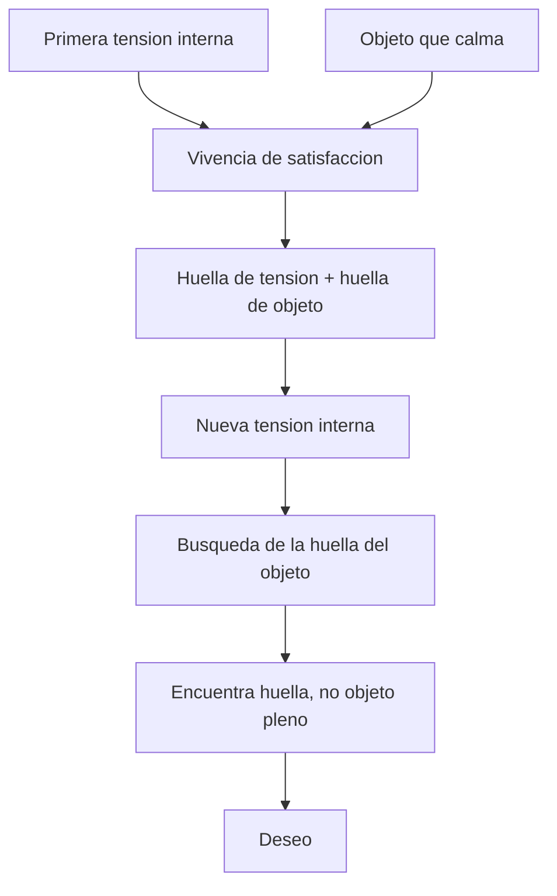
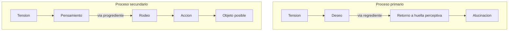
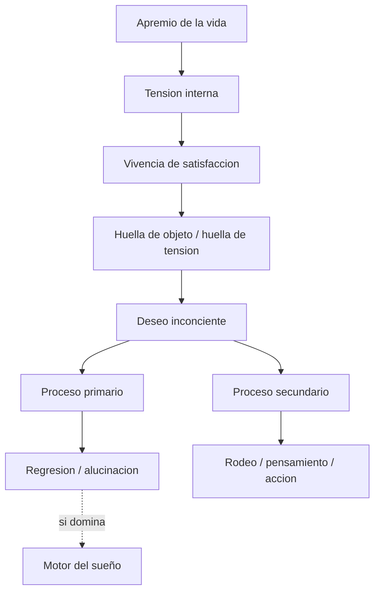

# Deseo y funcionamiento del aparato

## Problema

*Freud se pregunta por la naturaleza psíquica del desear.*

La pregunta no es psicológica en sentido común. Freud no quiere decir simplemente "qué quiere una persona". **Busca explicar qué mueve al aparato psíquico, especialmente al sueño.** Por eso distingue **necesidad, anhelo, pensamiento latente y \concept{deseo inconciente}**.

## Apremio de la vida

**Los estímulos internos, como el hambre, son continuos.** No se puede huir de ellos. Exigen una respuesta que el aparato no puede resolver por simple descarga.

A diferencia de los estímulos externos, de los que se puede escapar, **los estímulos internos insisten**. El bebé con hambre puede llorar, pero el llanto no satisface por sí mismo. **Hace falta una intervención que produzca satisfacción.**

## Vivencia de satisfaccion

*Una tensión interna se enlaza con un objeto que calma.* De esa experiencia quedan huellas:

- huella de tension;
- huella de objeto.

Cuando reaparece la tensión, **el aparato busca reencontrar esa satisfacción**.

*La primera satisfacción deja una marca.* Cuando vuelve la tensión, el aparato intenta repetir la experiencia, pero no encuentra el objeto original: *encuentra su huella*. Esta diferencia entre lo buscado y lo encontrado es fundamental.

### Checkpoint: vivencia de satisfaccion

Diagrama:

## Deseo

*El \concept{deseo} es la moción que busca reinvestir la huella de la satisfacción primera.* Pero encuentra una huella, no el objeto pleno. *Por eso el deseo es resto e insistencia.*

Rasgos:

- infantil;
- inmortal;
- inconciente;
- reprimido.

*Deseo no es lo mismo que anhelo.* El anhelo puede formularse en el preconciente: "quiero dormir", "quiero comer frutillas", "quisiera tal cosa". *El \concept{deseo inconciente} es la fuerza que motoriza la formación del sueño.* Freud lo compara con el socio capitalista: aporta la energía.

### Checkpoint: deseo inconciente

## Proceso primario y secundario

| Eje | Proceso primario | Proceso secundario |
|---|---|---|
| Sistema | Icc | Prcc/Cc |
| Meta | Identidad de percepcion | Identidad de pensamiento |
| Camino | Regrediente | Progrediente |
| Energia | Movil | Ligada |
| Mecanismos | Condensacion/desplazamiento | Rodeo, pensamiento, accion |

*El \concept{proceso primario} busca repetir la satisfacción por la vía más corta:* reinvestir la huella perceptiva. *Por eso tiende a la alucinación.* El \concept{proceso secundario} introduce demora. Soporta algo de displacer, liga la energía y permite pensamiento, tanteo y acción.

Diagrama:

## Formula

*El pensamiento es sustituto del deseo alucinatorio.*

## Cuadro clave

| Concepto | No confundir con |
|---|---|
| Deseo inconciente | Anhelo preconciente |
| Huella de objeto | Objeto real |
| Identidad de percepción | Identidad de pensamiento |
| Proceso primario | Proceso secundario |

## Formula de parcial

*El deseo es resto de una satisfacción perdida:* busca reencontrar la primera experiencia, pero solo encuentra huellas. *Por eso no se agota y puede motorizar el sueño.*

## Diagrama integrador

