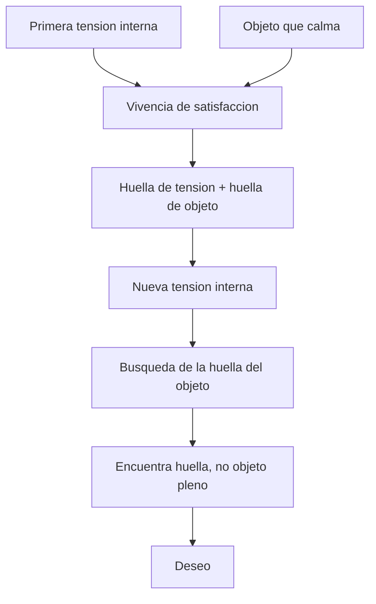
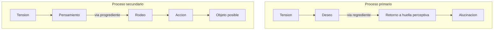

# Deseo y funcionamiento del aparato

## Problema

Freud se pregunta por la naturaleza psiquica del desear.

La pregunta no es psicologica en sentido comun. Freud no quiere decir simplemente "que quiere una persona". Busca explicar que mueve al aparato psiquico, especialmente al sueño. Por eso distingue necesidad, anhelo, pensamiento latente y deseo inconciente.

## Apremio de la vida

Los estimulos internos, como el hambre, son continuos. No se puede huir de ellos. Exigen una respuesta que el aparato no puede resolver por simple descarga.

A diferencia de los estimulos externos, de los que se puede escapar, los estimulos internos insisten. El bebe con hambre puede llorar, pero el llanto no satisface por si mismo. Hace falta una intervencion que produzca satisfaccion.

## Vivencia de satisfaccion

Una tension interna se enlaza con un objeto que calma. De esa experiencia quedan huellas:

- huella de tension;
- huella de objeto.

Cuando reaparece la tension, el aparato busca reencontrar esa satisfaccion.

La primera satisfaccion deja una marca. Cuando vuelve la tension, el aparato intenta repetir la experiencia, pero no encuentra el objeto original: encuentra su huella. Esta diferencia entre lo buscado y lo encontrado es fundamental.

Diagrama:

## Deseo

El deseo es la mocion que busca reinvestir la huella de la satisfaccion primera. Pero encuentra una huella, no el objeto pleno. Por eso el deseo es resto e insistencia.

Rasgos:

- infantil;
- inmortal;
- inconciente;
- reprimido.

Deseo no es lo mismo que anhelo. El anhelo puede formularse en el preconciente: "quiero dormir", "quiero comer frutillas", "quisiera tal cosa". El deseo inconciente es la fuerza que motoriza la formacion del sueño. Freud lo compara con el socio capitalista: aporta la energia.

## Proceso primario y secundario

| Eje | Proceso primario | Proceso secundario |
|---|---|---|
| Sistema | Icc | Prcc/Cc |
| Meta | Identidad de percepcion | Identidad de pensamiento |
| Camino | Regrediente | Progrediente |
| Energia | Movil | Ligada |
| Mecanismos | Condensacion/desplazamiento | Rodeo, pensamiento, accion |

El proceso primario busca repetir la satisfaccion por la via mas corta: reinvestir la huella perceptiva. Por eso tiende a la alucinacion. El proceso secundario introduce demora. Soporta algo de displacer, liga la energia y permite pensamiento, tanteo y accion.

Diagrama:

## Formula

El pensamiento es sustituto del deseo alucinatorio.

## Cuadro clave

| Concepto | No confundir con |
|---|---|
| Deseo inconciente | Anhelo preconciente |
| Huella de objeto | Objeto real |
| Identidad de percepcion | Identidad de pensamiento |
| Proceso primario | Proceso secundario |

## Formula de parcial

El deseo es resto de una satisfaccion perdida: busca reencontrar la primera experiencia, pero solo encuentra huellas. Por eso no se agota y puede motorizar el sueño.
