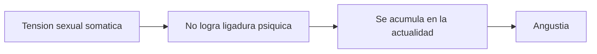
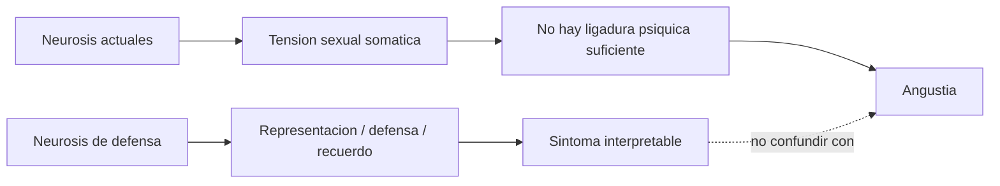

# Primera teoría de la angustia

## Problema

*La primera teoría de la angustia distingue neurosis de defensa y neurosis actuales.*

**Esta distinción evita un error frecuente:** no toda neurosis del primer Freud se explica por defensa, recuerdo inconciente y represión. Las neurosis actuales quedan en otro registro. Allí **no se trata de descifrar una representación reprimida**, sino de **una acumulación actual de excitación sexual somática**.

## Neurosis de defensa

Incluyen histeria y neurosis obsesiva.

*Hay:*

- mecanismo psíquico;
- representación;
- defensa;
- recuerdos inconcientes;
- posibilidad de interpretación.

En estas neurosis, **el psicoanálisis puede operar** porque hay representaciones, asociaciones y recuerdos. **El síntoma puede leerse como sustituto y como retorno.**

### Checkpoint: neurosis de defensa

## Neurosis actuales

Incluyen neurastenia y neurosis de angustia.

*No hay:*

- representación reprimida;
- mecanismo psíquico en el mismo sentido;
- dos tiempos;
- represión como en la histeria.

En las neurosis actuales, Freud ubica **una falla actual de tramitación**. La causa es sexual, pero no por una escena reprimida que deba reconstruirse. **La tensión se acumula porque no logra ligarse psíquicamente.**

### Checkpoint: neurosis actuales

## Angustia

*La \concept{angustia} surge por acumulación de tensión sexual somática que no logra ligadura psíquica.* Es *afecto sin representación.*

La tensión debería alcanzar un umbral y enlazarse con una representación sexual o fantasía. Si eso no ocurre, **no se tramita psíquicamente y se muda en angustia**. Por eso esta angustia **no se reduce por interpretación** como un síntoma histérico.

## Cuerpo

| Histeria | Angustia |
|---|---|
| Cuerpo simbólico | Cuerpo somático |
| Conversión | Transposición de tensión |
| Hay mensaje a descifrar | No hay representación a interpretar |

## Formula

*En la histeria, el cuerpo habla. En la angustia, el cuerpo descarga una tensión no ligada.*

## Cuadro de parcial

| Eje | Neurosis de defensa | Neurosis actuales |
|---|---|---|
| Representación | Si | No como representación reprimida |
| Recuerdo inconciente | Si | No |
| Dos tiempos | Puede haber | No |
| Represión | Central | No central |
| Tratamiento freudiano inicial | Opera por asociaciones | No opera igual |
| Causa | Conflicto psíquico | Acumulación actual |

## Cuadro principal

| Eje | Neurosis de defensa | Neurosis actuales |
|---|---|---|
| Textos guía | Histeria, neurosis obsesiva, Emma, Manuscrito K | Primera teoría de la angustia, neurastenia, neurosis de angustia |
| Núcleo explicativo | Conflicto psíquico y defensa | Tensión sexual somática actual |
| Qué se separa o fracasa | Representación y monto de afecto; retorno de lo reprimido | Falta de ligadura psíquica de la excitación |
| Temporalidad | Puede haber retroacción y dos tiempos | Actualidad, acumulación presente |
| Relación con el cuerpo | Cuerpo simbólico, conversión, síntoma interpretable | Descarga somática, angustia sin mensaje |
| Vía de abordaje | Asociación, interpretación, reconstrucción | No se resuelve igual por interpretación |

## Advertencia

Si la consigna pregunta por primera teoría de la angustia, **no responder con trauma en dos tiempos ni con retorno de lo reprimido**. **La clave es tensión sexual somática no ligada psíquicamente.**

## Diagrama integrador

