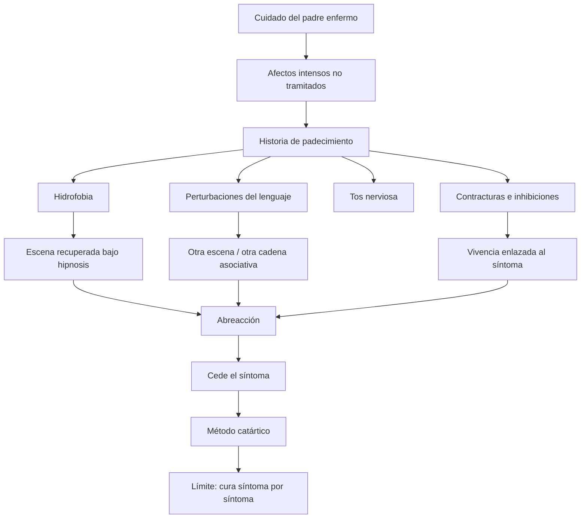

# Caso Anna O.

## Para qué sirve

- Pasaje de la histeria traumática de Charcot a la histeria común de Breuer/Freud.
- Método catártico.
- Vivencias teñidas de afecto.
- Síntoma como texto a descifrar.
- Límite de una cura síntoma por síntoma.

## Historia familiar y escenas iniciales

- Anna O. es una joven muy inteligente, muy ligada a su padre y situada durante meses en el lugar de cuidadora.
- En 1880 el padre cae gravemente enfermo y ella queda absorbida por la vigilia, el cansancio y la preocupación.
- En ese período aparecen somnolencias, estados de ausencia y una escisión entre un funcionamiento diurno perturbado y otro nocturno más lúcido.
- Junto al lecho del padre tiene la escena de la serpiente: el brazo derecho dormido, imposibilidad de moverlo, terror, oración y pasaje forzado al inglés.
- Tras la muerte del padre, en abril de 1881, el cuadro se intensifica.
- El tratamiento va reconduciendo síntoma por síntoma a una escena o serie de escenas.
- La hidrofobia se aclara cuando recuerda con asco haber visto a un perro beber de un vaso.
- El caso queda ordenado, entonces, por esta secuencia: **cuidado del padre, escenas intensas, síntomas, recuperación del recuerdo, abreacción**.

## Raconto mínimo

Anna O. aparece en *Estudios sobre la histeria* como el gran caso emblema de Breuer. Lo decisivo no es un accidente corporal único, sino **una historia de padecimiento** ligada al cuidado de su padre enfermo, estados de ausencia, escenas intensas y afectos que no encontraron tramitación.

En ese contexto aparecen síntomas diversos:

- perturbaciones del lenguaje;
- inhibiciones y contracturas;
- tos nerviosa;
- alteraciones visuales;
- hidrofobia.

Breuer advierte que **cada síntoma puede reconducirse a una escena** o serie de escenas. Bajo hipnosis, al recuperar el recuerdo y descargar el afecto ligado a esa vivencia, el síntoma cede. Por eso Anna O. es la gran demostración inicial de que el síntoma histérico **tiene determinación psíquica**.

## Escenas clave

No conviene aprender Anna O. como una anécdota única, sino como una constelación.

### 1. Enfermedad del padre

El cuidado del padre enfermo organiza el trasfondo del caso. Allí se concentran:

- vigilia;
- agotamiento;
- afectos contrariados;
- imposibilidad de responder;
- escenas que quedan como restos activos.

Ese fondo muestra que la histeria común no se explica por un gran choque físico, sino por una trama de vivencias con afecto.

### 1 bis. Estados de ausencia y "clouds"

El caso no se ordena solo por escenas aisladas, sino también por un modo de funcionamiento:

- a la tarde aparecen somnolencias y ausencias;
- al anochecer entra en un estado más profundo, al que llama *clouds*;
- si en ese estado puede narrar las escenas o alucinaciones del día, despierta más tranquila y clara.

Esto es importante porque muestra una forma temprana de escisión psíquica: no hay una conciencia unificada, sino estados relativamente separados.

### 2. La escena de la serpiente

Durante una vigilia junto al padre tiene una alucinación: ve una serpiente acercarse a la cama. El brazo derecho, apoyado y dormido, queda paretico y anestesiado. Intenta rezar, pero no puede hacerlo en alemán; termina encontrando palabras solo en inglés.

La escena concentra varias marcas decisivas:

- terror;
- parálisis del brazo;
- irrupción de una lengua extraña;
- formación simultánea de varios síntomas.

### 3. Hidrofobia

Uno de los episodios más conocidos es el de la imposibilidad de beber agua. Bajo hipnosis, emerge una escena en la que algo visto con asco y retenido sin descarga queda enlazado al síntoma. Cuando la escena se recuerda y se tramita, el síntoma cede.

Este ejemplo es muy útil para el parcial porque deja ver de forma casi escolar:

- escena;
- afecto retenido;
- síntoma;
- recuperación del recuerdo;
- abreacción;
- desaparición del síntoma.

### 4. Lenguaje y escisión

En Anna O. también hay trastornos del habla y momentos en que solo puede hablar en otra lengua. Lo importante ahí no es el color pintoresco del caso, sino que el síntoma ya no parece solo corporal: **el lenguaje mismo entra en la lógica histérica**.

Eso es central para Freud porque permite pasar del cuerpo golpeado al cuerpo hablado, y del accidente externo al problema de la representación.

## Diagrama de asociaciones

## Cómo lo leen Breuer y Freud

- El síntoma no es arbitrario.
- Tiene una **referencia simbólica** o asociativa.
- Conserva la intensidad de una vivencia no tramitada.
- La hipnosis permite recuperar la escena olvidada.
- La palabra puede operar como vía de descarga.

En Anna O. conviene además poder decir la secuencia de trabajo casi como una fórmula clínica:

1. escena intensa;
2. afecto no tramitado;
3. síntoma;
4. recuerdo recuperado bajo hipnosis;
5. abreacción;
6. desaparición puntual del síntoma.

La tesis fuerte es esta: *el histérico padece de reminiscencias*. El síntoma testimonia una escena que no fue suficientemente tramitada y que sigue actuando.

## Qué hay que retener

| Eje | Punto |
|---|---|
| Tipo de histeria | Histeria común, no solo gran trauma físico |
| Método | Hipnosis y catarsis |
| Núcleo | Vivencias teñidas de afecto |
| Fórmula clínica | Recuerdo + afecto retenido + síntoma |
| Alcance | El síntoma cede al recordar y abreaccionar |
| Límite | No basta para pensar toda la histeria ni la resistencia |

## Fórmula

*Anna O. muestra que el síntoma histérico puede leerse como el retorno de una vivencia con afecto no tramitado, recuperable por hipnosis y abreacción.*

## Error frecuente

- Reducir Anna O. a “un caso de hipnosis que cura”.
- Presentarla como si hubiera un único trauma simple.
- Olvidar que el caso también muestra un límite: el método catártico trabaja síntoma por síntoma, pero todavía no alcanza para pensar resistencia, sobredeterminación y núcleo patógeno como lo hará Freud después.
