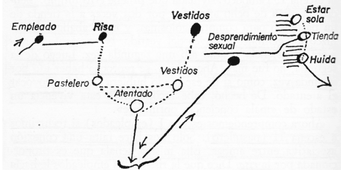

# Caso Emma

## Para que sirve

- Trauma en dos tiempos.
- Eficacia póstuma.
- Diferencia entre vivencia y recuerdo.
- Determinismo no azaroso del síntoma.

## Línea mínima de escenas

- A los ocho años, Emma entra a una tienda a comprar dulces.
- El comerciante le toca los genitales por encima de la ropa.
- A pesar del primer episodio, vuelve una segunda vez y después queda un fuerte autorreproche.
- A los once o doce años, ya en pubertad, entra sola en otra tienda.
- Dos empleados se ríen; uno de ellos le resulta sexualmente atractivo.
- Emma huye aterrada.
- Desde entonces no puede entrar sola a tiendas.
- El análisis muestra que la segunda escena despierta la primera y le da un sentido sexual nuevo.

## Raconto minimo

Emma sirve precisamente para romper una causalidad lineal. No hay “un trauma y después un síntoma”, sino dos escenas articuladas.

Hay una **escena infantil** en la que un comerciante la toca por encima de la ropa. En ese momento no se produce todavía el efecto traumático pleno que Freud quiere pensar. Más tarde, ya cerca de la pubertad, una **segunda escena** en otra tienda, ligada otra vez a risa, vestido y situación comercial, despierta el recuerdo anterior. A partir de ahí Emma ya no puede entrar sola a tiendas.

Lo decisivo no es una escena aislada. La escena posterior despierta la anterior y le da un valor psíquico nuevo.

## Primer tiempo

- Emma tiene ocho años.
- Entra a una tienda a comprar golosinas.
- El comerciante la toca por encima de la ropa.
- Aun así vuelve una segunda vez.
- Después queda una marca de mala conciencia o autorreproche.

En este primer tiempo hay inscripción, pero no todavía la eficacia traumática plena.

## Segundo tiempo

- Emma tiene once o doce años.
- Entra sola a otra tienda.
- Dos dependientes se ríen entre sí.
- Uno de ellos le gusta o la atrae sexualmente.
- Emma huye presa de angustia.
- Desde ese momento no puede ir sola a tiendas.

La segunda escena no explica sola el síntoma. Lo que hace es **despertar retroactivamente** la primera.

## Diagrama de clase

*La cadena muestra cómo la escena posterior despierta, por enlaces no azarosos, la escena infantil y el desprendimiento de displacer.*

## Como lo lee Freud

- La escena infantil no produce en su momento todo el efecto traumatico.
- La pubertad modifica la posibilidad de leer sexualmente la escena anterior.
- El recuerdo produce a posteriori el displacer que la vivencia no habia producido asi en su momento.
- El síntoma queda determinado por el encadenamiento entre escenas.

En Emma conviene poder decir la secuencia casi en forma de fórmula:

1. escena infantil;
2. inscripción;
3. pubertad;
4. segunda escena;
5. despertar del recuerdo;
6. desprendimiento retroactivo de displacer;
7. defensa y síntoma.

## Que hay que retener

| Eje | Punto |
|---|---|
| Tiempo 1 | Escena infantil que queda inscripta |
| Tiempo 2 | Escena posterior que despierta el recuerdo |
| Nexo | Risa, vestido, situacion de tienda |
| Efecto | Desprendimiento retroactivo de displacer |
| Resultado | Síntoma: no poder entrar sola a tiendas |

## Formula

*En Emma, el trauma no es lineal: una escena posterior resignifica una anterior y vuelve eficaz al recuerdo.*

## Error frecuente

- Reducir el caso a "una vivencia sexual infantil" sin mostrar la retroacción.
- Decir que el síntoma sale de una sola escena.
