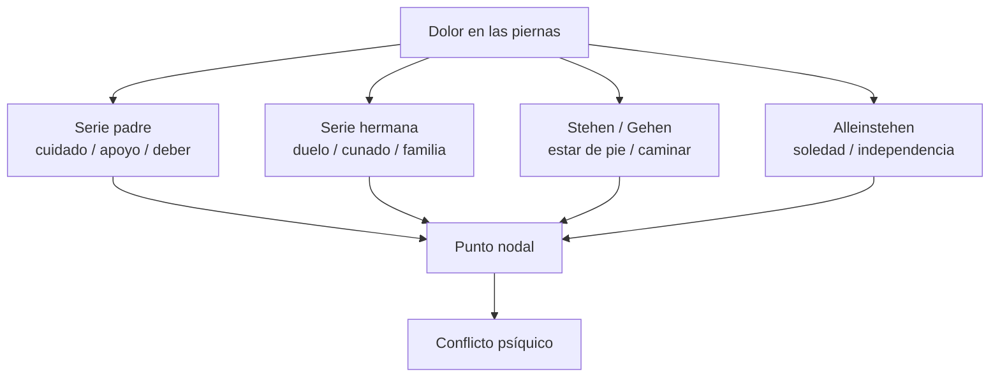

# Caso Elisabeth von R.

## Para que sirve

- Sobredeterminación del síntoma.
- Ordenamiento del material psíquico.
- Resistencia.
- Cuerpo simbolico.

## Historia familiar y escenas iniciales

- Hija menor de tres hermanas.
- El padre esperaba un hijo varón; Elisabeth queda ubicada en cierto lugar de hija-varón.
- Tiene formación intelectual y un vínculo muy fuerte con el padre.
- El padre no espera que ella arme una vida fuera de él.
- Cuando el padre enferma, Elisabeth queda fuertemente tomada por la posición de cuidadora.
- Muere el padre.
- Luego enferma la madre, viuda y sola; Elisabeth vuelve a ocupar un lugar central de cuidado.
- Una hermana se casa y se muda lejos; Elisabeth odia a ese cuñado por alejarla de la familia.
- Otra hermana se casa y queda cerca; ese cuñado, en cambio, le cae bien.
- Cuando la madre mejora, hacen un viaje de distensión familiar.
- Elisabeth enferma: pasa de enfermera a enferma de la familia.
- Más adelante muere la segunda hermana al tener su segundo hijo, y el marido se aleja culpabilizado.

## Raconto del caso

- El síntoma aparece como dolor en las piernas y dificultad para caminar.
- Freud no logra hipnotizarla, así que no avanza por catarsis clásica.
- Los primeros recuerdos que aparecen son más superficiales.
- El análisis va siguiendo el síntoma, las resistencias y las asociaciones.
- Freud no encuentra una sola causa: encuentra **series asociativas que convergen**.

## Primer registro del dolor

- Mientras el padre estaba enfermo, Elisabeth tuvo una cita.
- Pensaba que con ese hombre podría casarse.
- Ese mismo día el padre sufrió un ataque al corazón y quedó muy mal.
- Elisabeth no vuelve a ver a ese joven.
- Allí aparece el primer registro del dolor en la pierna.
- Todavía no está formado todo el síntoma, pero sí queda armada una primera articulación entre deseo propio, culpa y deber filial.

## Por qué la pierna

- Freud se pregunta por qué el dolor se localiza justamente en esa pierna.
- El padre apoyaba su pierna sobre ella durante los cuidados.
- El cuerpo queda tomado por una referencia simbólica ligada al cuidado del padre.
- Así, el síntoma no solo dice algo del conflicto: también se localiza en una zona corporal cargada de historia.

## Series que convergen

| Serie | Escenas / significantes | Funcion |
|---|---|---|
| Padre | Cuidado, apoyo de la pierna, deber | Liga el síntoma al lugar de cuidadora |
| Hermana | Muerte, duelo, cunado | Introduce conflicto afectivo y familiar |
| Stehen | Estar de pie, quedar detenida | Marca petrificacion |
| Gehen | Caminar, desplazarse | Muestra movimiento impedido |
| Alleinstehen | Estar sola, sostenerse sola | Toca independencia y deseo propio |

## Diagrama

## Como lo lee Freud

- El síntoma no es un cuerpo extraño que se extirpa.
- El síntoma está infiltrado en la historia, el lenguaje y la posición subjetiva.
- Varias cadenas asociativas aportan un sentido parcial.
- El dolor en la pierna es un punto de convergencia.
- El análisis no pregunta solo "qué pasó", sino cómo se enlazan escenas, palabras, posiciones corporales y afectos.

## Lo que mas conviene decir en parcial

- Elisabeth no sirve para mostrar un "amor por el cuñado" como explicación única.
- El profesor suele marcar que ese sería un recorte empobrecido del caso.
- Sirve para mostrar que el síntoma está sobredeterminado.
- Sirve para mostrar que el analisis avanza por hilos, resistencias y puntos nodales.
- Sirve para formular un conflicto entre una posición deseante propia y el lugar de hija-cuidadora dentro de la familia.

## Formula

*En Elisabeth, el síntoma no tiene un sentido único: varias series asociativas convergen en un mismo punto.*
