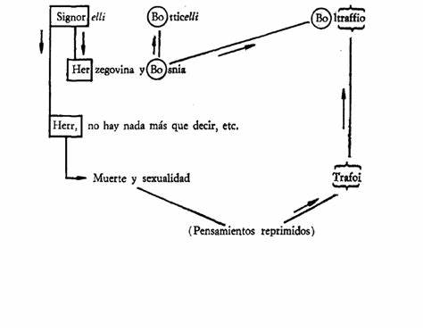

# Caso Signorelli

## Para que sirve

- Olvido de nombres propios.
- Formacion del inconciente en la vida cotidiana.
- Sustitucion.
- Puentes lingüísticos y asociaciones extrínsecas.

## Raconto minimo

- Freud quiere recordar el nombre del pintor Signorelli.
- No puede hacerlo.
- En su lugar le vienen Botticelli y Boltraffio.
- El olvido queda enlazado a una cadena asociativa que toca Bosnia, Herzegovina, Herr, Trafoi, muerte y sexualidad.

No es una falla cualquiera de la memoria. El olvido tiene forma, camino y sustitutos.

## Diagrama de clase

*Los nombres sustitutivos no aparecen al azar: conservan fragmentos y puentes del nombre olvidado y del tema reprimido.*

## Como lo lee Freud

- El nombre olvidado queda arrastrado por pensamientos reprimidos.
- Los nombres que aparecen en su lugar no son errores brutos.
- Conservan restos fonéticos, fragmentos verbales o enlaces laterales.
- La memoria falla con sentido.

## Que retener

| Eje | Punto |
|---|---|
| Nombre olvidado | Signorelli |
| Nombres sustitutivos | Botticelli, Boltraffio |
| Tipo de enlace | Fónico, verbal, circunstancial |
| Fondo reprimido | Muerte y sexualidad |
| Tesis | El olvido es una formacion del inconciente |

## Formula

*Signorelli muestra que el olvido no es ausencia pura: en su lugar aparecen sustituciones motivadas.*
