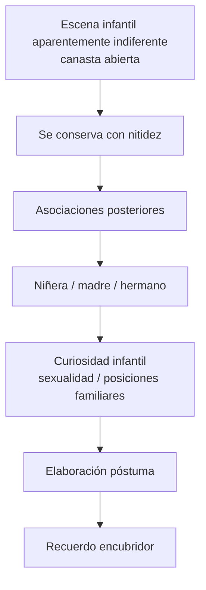

# Recuerdos encubridores

## Para que sirve

- Mostrar que la memoria infantil no es copia fiel.
- Pensar *elaboración póstuma*.
- Ubicar cómo opera el desplazamiento sobre un recuerdo aparentemente indiferente.
- Tener un caso concreto para no hablar de recuerdos encubridores en abstracto.

## Tesis mínima

*El \concept{recuerdo encubridor} no vale por lo que muestra de frente, sino por lo que conserva y encubre a la vez.*

Freud no dice simplemente que el recuerdo infantil sea falso. Dice algo más fino: **lo que llega a la memoria conciente suele ser una construcción posterior**, armada bajo la presión de otras escenas, otros deseos y otras asociaciones. Por eso el recuerdo que se conserva puede ser banal en apariencia y, sin embargo, psíquicamente precioso.

## El caso de la canasta

Freud aísla un recuerdo infantil aparentemente mínimo:

- una escena visual;
- una \concept{canasta} o recipiente abierto;
- un clima de cotidianeidad;
- la presencia de figuras familiares y de la niñera.

Tomado aisladamente, el recuerdo parece irrelevante. **Justamente ahí está el problema**: si fuera solo un detalle indiferente, no se entendería por qué se conserva con tanta nitidez mientras tantos otros recuerdos infantiles se pierden.

## Cómo se reconstruye

La escena no se interpreta como si fuera una foto transparente de la infancia. Freud avanza por asociaciones:

- el recuerdo de la canasta;
- la niñera;
- la madre;
- el hermano;
- escenas ligadas a curiosidad, cuidado, sexualidad y posición del niño frente a lo femenino.

El punto no es decidir qué “pasó realmente” en términos positivistas, sino mostrar que **el recuerdo conservado funciona como pantalla**. Guarda algo, pero lo guarda desplazado.

## Qué enseña el caso

### 1. No hay copia directa de la infancia

Freud remarca que muchas veces los llamados recuerdos infantiles:

- tienen forma escénica;
- nos muestran casi como si nos viéramos desde afuera;
- aparecen como imágenes compuestas;
- están reconstruidos desde un tiempo posterior.

Eso ya alcanza para romper la idea de una memoria ingenua.

### 2. El acento psíquico se desplaza

Lo que importa no aparece donde “debería” aparecer. **El valor psíquico se desplaza hacia un detalle secundario**. La canasta, en ese sentido, no es importante por sí misma: importa porque quedó investida como soporte de otra serie.

### 3. La escena encubre y conserva

El recuerdo encubridor no elimina por completo el nexo reprimido. **Lo conserva bajo otra forma**. Por eso es interpretable.

## Diagrama de lectura

## Fórmula de parcial

*El recuerdo encubridor muestra que la memoria infantil no reproduce simplemente la vivencia: la reconstruye a posteriori, desplazando el acento hacia una escena aparentemente indiferente que encubre otra serie significativa.*

## Qué conviene nombrar

| Eje | Punto |
|---|---|
| Memoria infantil | No es copia fiel |
| Temporalidad | Elaboración posterior |
| Mecanismo fuerte | Desplazamiento |
| Valor del recuerdo | Encubre y conserva |
| Caso | La canasta, articulada con niñera, madre y hermano |

## Error frecuente

- Decir solo que “Freud se acuerda de una canasta” sin reconstruir por qué ese recuerdo cuenta.
- Reducir el caso a un símbolo fijo.
- Perder la idea de que **el recuerdo vale por la red asociativa que lo hace hablar**.
