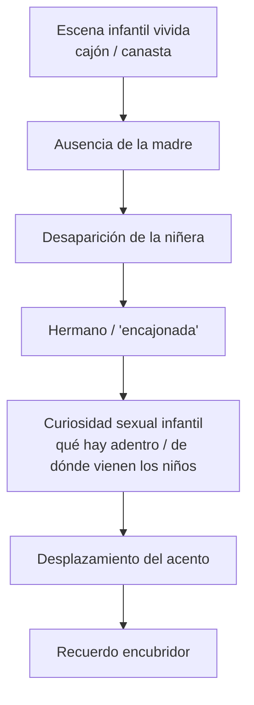

# Recuerdos encubridores

## Para qué sirve

- Bajar a una escena concreta la teoría del recuerdo encubridor.
- Seguir paso a paso una red asociativa infantil.
- Ver cómo una imagen aparentemente banal se vuelve interpretable.

La conceptualización general del recuerdo encubridor conviene desarrollarla en [Formaciones del inconsciente](../02-sintesis-integrada/04-formaciones-del-inconciente.md). Acá el foco está puesto en **este caso puntual**.

## El caso del cajón / canasta

Freud aísla un recuerdo infantil muy vívido:

- llora frente a un **cajón, armario o canasta**;
- pide que lo abran;
- interviene el hermano;
- al final aparece la madre, de regreso, “bella y esbelta”.

Tomado aisladamente, el recuerdo parece casi banal. **Justamente ahí está el problema**: si fuera solo una escena indiferente, no se entendería por qué quedó fijada con tanta nitidez.

## Cómo se reconstruye

Freud no trata la escena como una fotografía fiel, sino como un **recuerdo a interpretar**.

### 1. La ausencia de la madre

El primer sentido que reconstruye es simple: **el niño había notado la ausencia de la madre**. Supone entonces que puede estar dentro del cajón o recipiente. Por eso exige que lo abran y rompe en llanto cuando no la encuentra. El alivio llega cuando la madre reaparece.

### 2. La niñera desaparecida

Esa escena se enlaza con otro dato que Freud recupera después: una **niñera** muy presente en su infancia había desaparecido de pronto. Más tarde se entera de que:

- la habían echado de la casa;
- había robado;
- el hermanastro la había denunciado o entregado.

Freud conserva además restos de sueños y recuerdos ligados a ella, por ejemplo que le hacía entregarle las moneditas que recibía. La desaparición de la niñera deja entonces una marca de enigma infantil: alguien estaba y de golpe ya no está.

### 3. La idea de que alguien está “encajonado”

El hermanastro habría explicado la desaparición de la niñera diciendo que estaba “encajonada” o “guardada”. Freud niño entiende esa frase de manera casi literal. Cuando luego falta la madre, se activa el temor de que **también ella pueda estar metida dentro del cajón**.

Ahí el recuerdo deja de ser una escena mínima y se vuelve una construcción densa:

- ausencia de la madre;
- desaparición de la niñera;
- hermano que sabe algo más;
- cajón/canasta como lugar donde alguien puede quedar oculto.

### 4. La curiosidad sexual infantil

La interpretación no se detiene en la angustia por la ausencia. Freud vincula la escena con el momento en que ya circula para el niño la pregunta por **de dónde vienen los niños**. La madre había estado ligada al nacimiento de una hermana, y el cajón o recipiente termina funcionando como una figura del **interior del cuerpo materno**.

Por eso el recuerdo condensa:

- miedo a perder a la madre;
- curiosidad por lo que hay “adentro”;
- la idea de que de ese interior pueden salir niños;
- rivalidad y sospecha respecto del hermano o de la figura masculina.

### 5. Qué importa del caso

El punto no es fijar un símbolo universal de “la canasta”. **Lo decisivo es la red asociativa**:

- madre ausente;
- niñera desaparecida;
- cajón/canasta;
- curiosidad sexual infantil;
- pregunta por el origen de los niños;
- desplazamiento del acento hacia una imagen tolerable.

Así se ve cómo una escena pequeña puede quedar fijada como punto de apoyo de una red mucho más amplia.

## Diagrama de lectura

## Qué conviene nombrar

| Eje | Punto |
|---|---|
| Escena recordada | Cajón / canasta, madre ausente, hermano |
| Serie asociativa | Niñera desaparecida, “encajonada”, curiosidad infantil |
| Punto fuerte | La escena vale por la red que la hace hablar |
| Pregunta sexual | Qué hay adentro, de dónde vienen los niños |
| Utilidad | Dar carne clínica al concepto de recuerdo encubridor |

## Error frecuente

- Decir solo que “Freud se acuerda de una canasta” sin reconstruir la ausencia de la madre, la desaparición de la niñera y la pregunta infantil por lo que hay adentro.
- Reducir el caso a un símbolo fijo.
- Perder la idea de que **el recuerdo vale por la red asociativa que lo hace hablar**.
