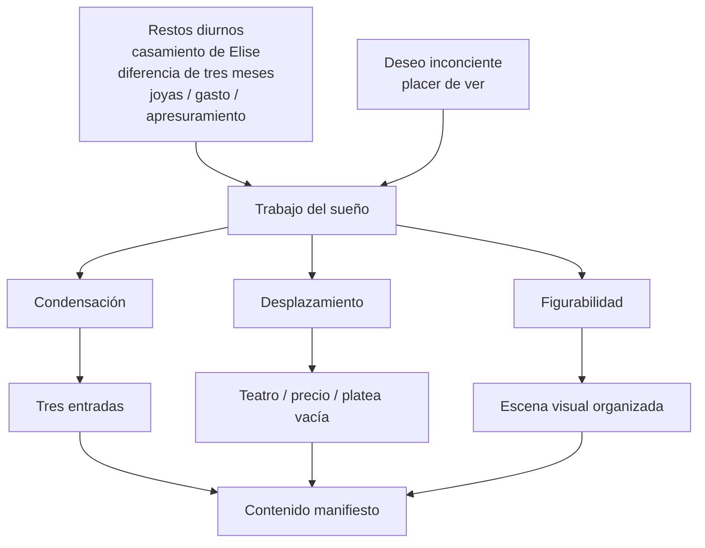

# Sueño de las tres entradas de teatro

## Para que sirve

- Desarrollar el trabajo del sueño en un caso concreto.
- Ubicar restos diurnos, desplazamiento, condensación y figurabilidad.
- No hablar del sueño solo en abstracto.

## Tesis mínima

*En el sueño de las tres entradas, el conflicto no aparece de frente: se desplaza hacia una escena de teatro y gasto, donde varios restos diurnos y una serie de asociaciones quedan condensados en una imagen aparentemente simple.*

## Contenido manifiesto

Freud relata un sueño en el que aparecen:

- tres entradas de teatro;
- un precio de `1,50 florines`;
- la idea de haberlas conseguido demasiado temprano o apresuradamente;
- una \concept{platea vacía}.

Tomado en bruto, parece un sueño banal sobre salidas, dinero y teatro. **El análisis muestra que esa escena manifiesta reagrupa otra serie.**

## Restos diurnos y asociaciones

Entre las asociaciones que interesan aparecen:

- la noticia de que Elise o una mujer más joven se casó;
- la comparación temporal: ser tres meses menor o mayor;
- la idea de *haberse apresurado*;
- el tema del gasto o del precio;
- la crítica a la cuñada o a otra mujer por comprar joyas demasiado pronto;
- la oposición entre haber pagado poco y haber conseguido algo “cien veces mejor”.

Lo importante no es encontrar una clave única, sino mostrar cómo **múltiples elementos convergen en el contenido manifiesto**.

## Cómo se lee

### 1. Desplazamiento

La cuestión de:

- casarse;
- apresurarse;
- elegir demasiado pronto;
- calcular mal el momento;

queda desplazada hacia:

- ir al teatro;
- comprar entradas;
- pagar `1,50`;
- encontrar una platea vacía.

**El sueño no dice “me apresuré”**; arma una escena equivalente.

### 2. Condensación

En `tres entradas` se condensan varias referencias:

- la cifra tres;
- la diferencia temporal;
- el resto diurno de un casamiento;
- la economía del gasto;
- la comparación con una adquisición mejor.

Una sola imagen manifiesta carga varias líneas a la vez.

### 3. Figurabilidad

El conflicto se vuelve escena visible. En lugar de una serie de juicios abstractos, el sueño ofrece:

- platea;
- entradas;
- precio;
- situación de estar viendo.

Eso es decisivo para Freud: **el sueño transpone pensamientos en imágenes**.

### 4. Deseo

La escena no se reduce al reproche manifiesto. Freud también localiza algo del \concept{placer de ver}. El teatro permite figurar una satisfacción escópica que no coincide simplemente con la moral del relato conciente.

## Diagrama de lectura

## Cuadro mínimo

| Elemento manifiesto | Serie asociativa que conviene nombrar |
|---|---|
| Tres entradas | Diferencia temporal, cifra tres, casamiento |
| 1,50 florines | Gasto, cálculo, valor |
| Platea vacía | Escena de ver, oportunidad, disponibilidad |
| Teatro | Desplazamiento del conflicto hacia una escena figurada |
| Apresuramiento | Tema latente de elección y timing |

## Fórmula de parcial

*En el sueño de las tres entradas, los restos diurnos ligados al casamiento, al gasto y al apresuramiento son trabajados por condensación, desplazamiento y figurabilidad. El conflicto no se enuncia directamente: aparece escenificado en el teatro, el precio y la platea vacía.*

## Error frecuente

- Mencionar solo “restos diurnos” sin trabajar los elementos del sueño.
- Usar el caso como ejemplo de una sola operación.
- Perder la idea de que **el sueño articula simultáneamente precio, tiempo, mirada y deseo**.
