# Psicoanalisis 1 - Freud, catedra Laznik

## Proposito del libro

Material de estudio para el primer parcial, organizado para responder preguntas a desarrollar. El criterio no es resumir texto por texto en orden lineal, sino reconstruir los conceptos por ejes, con cuadros comparativos, mapas conceptuales y articulaciones clinicas.

Alcance actual:

- Guía 1: Defensa, histeria, formaciones del inconsciente y primera teoría de la angustia.
- Guia 2: Sueños y aparato psiquico.
- Programa 2026: fuente para controlar textos y paginas indicadas.

## Forma esperada del parcial

- 4 preguntas a desarrollar.
- 2 preguntas de practicos.
- 1 pregunta de teorico.
- 1 pregunta de seminario.

Hipotesis de preparacion:

- Teorico: tema visto solo en teorico.
- Practico: alta probabilidad de aparato psiquico: Cc, Icc, Prcc.
- Seminario/practico: formaciones del inconciente, sueño, chiste, trabajo del sueño.
- Trauma: distinguir trauma histerico en mecanismos psiquicos y trauma en dos tiempos en Manuscrito K.
- Articulacion con ejemplo clinico: estratificacion del material psiquico con Elisabeth von R.

## Enfasis de clase

Esta sección registra marcas de cursada: insistencias docentes, alertas de confusión y ejemplos trabajados. Debe funcionar como brújula para priorizar el desarrollo del libro.

### Teoricos - Mecanismo psiquico de la histeria y Psicoterapia de la histeria

Textos de clase:

- Sobre el mecanismo psiquico de los fenomenos histericos, con Breuer.
- Sobre la psicoterapia de la histeria, Freud solo.

Problema general:

- Objetivo: explicar la patogenesis de los sintomas histericos.
- Hipotesis freudiana: las causas deben buscarse en el ambito psiquico, no en la simulacion ni en una arbitrariedad corporal.
- Punto de apoyo inicial: Charcot, pero Freud desplaza el problema hacia el trauma psiquico y la representacion.

Linea historica de la tecnica y del problema:

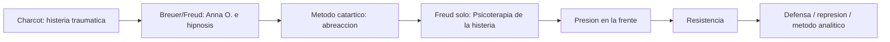

Cuadro temporal del problema del sintoma, la defensa y el trauma:

| Ano | Problema que estudia Freud | Textos / zona conceptual | Formula de clase | Tipo de trauma |
|---|---|---|---|---|
| 1893 | Sintoma histerico | Mecanismo psiquico de los fenomenos histericos | Trauma psiquico, afecto no abreaccionado, escision del monto de afecto | Trauma 1: vivencia con afecto no tramitado |
| 1894 | Accion de la defensa | Neuropsicosis de defensa; Psicoterapia de la histeria | Conflicto -> defensa -> escision de conciencia; la escision no es propia solo de la histeria | Trauma 2: representacion inconciliable y defensa |
| 1895 | Trauma en dos tiempos | Emma / proton pseudos; Manuscrito K | Infancia -> pubertad; el recuerdo despierta displacer -> represion | Trauma 3: eficacia postuma del recuerdo |

Advertencia:

- No usar "trauma" como si fuera una nocion unica y estable.
- En 1893 el eje es la no abreaccion de una vivencia tenida de afecto.
- En 1894 el eje se desplaza a la defensa frente a una representacion inconciliable.
- En 1895 aparece con mas fuerza la temporalidad en dos tiempos: una escena infantil cobra eficacia traumatica a posteriori, por el recuerdo y la pubertad.

Cuadro Charcot / Breuer-Freud / Freud:

| Eje | Charcot | Breuer + Freud | Freud solo |
|---|---|---|---|
| Objeto | Histeria traumatica | Histeria comun, Anna O. | Histeria de defensa |
| Trauma | Accidente, gran trauma, peligro corporal | Vivencias teñidas de afecto | Conflicto psiquico, defensa, nucleo patogeno |
| Causa del sintoma | No es el golpe mismo, sino la representacion asociada | Recuerdo no abreaccionado | Representacion inconciliable y resistencia |
| Metodo | Hipnosis para reproducir o suprimir sintomas | Hipnosis / catarsis | Presion en la frente, trabajo contra resistencias |
| Limite | No explica sintomas no corporales ni histeria comun | Cura sintomas, no la histeria como tal | Descubre resistencia y sobredeterminacion |

Charcot como punto de apoyo:

- Saca a la histeria del registro de la simulacion.
- La trata como cuadro clinico.
- Estudia especialmente la histeria traumatica.
- La hipnosis muestra que la causa no es el golpe en si, sino la representacion vinculada al acontecimiento.
- Limite para Freud: Charcot trabaja con gran trauma fisico y no explica bien la histeria comun ni sintomas como los de Anna O. ligados al lenguaje.

Anna O. y trauma psiquico:

- Breuer y Freud buscan bajo que condiciones se produjo el sintoma.
- El paciente no recuerda: aparece el olvido.
- La hipnosis permite recuperar escenas olvidadas.
- Al recuperar el recuerdo, el sintoma puede cesar.
- Se accede a vivencias teñidas de afecto, cuya intensidad no se desgasto con el tiempo.
- En la histeria comun no hay un unico episodio, sino una historia de padecimiento: muchos episodios enlazados.

Primera tesis fuerte:

- Toda histeria es traumatica en la medida en que actua un trauma psiquico.
- El trauma no es necesariamente el accidente fisico, sino una vivencia o cadena de vivencias que conserva afecto no tramitado.

Esquema sintoma-lenguaje-cuerpo:


El sintoma:

- No es arbitrario.
- Es un texto hecho de palabras que toman el cuerpo.
- Tiene una referencia simbolica.
- Puede hacer hablar aquello que el paciente no sabe concientemente.

Segunda tesis: principio de constancia

- Una impresion psiquica acrecienta la suma de excitacion.
- La tarea del aparato es disminuir o descargar esa suma.
- Todo aumento de excitacion se siente como displacer.
- El afecto adherido al recuerdo debe tramitarse para perder intensidad.

Esquema de abreaccion:

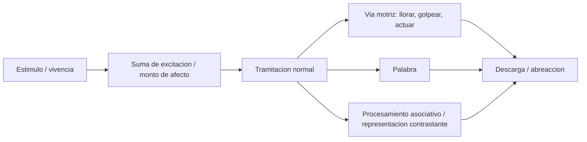

Abreaccion:

- Posibilidad de tramitacion y descarga de la suma de excitacion.
- Puede darse por via motriz, palabra o procesamiento asociativo.
- Si no ocurre, el recuerdo conserva intensidad y puede producir sintoma.

Por que no se tramita:

- El trauma puede ser demasiado grande.
- El sujeto puede no querer reaccionar o no poder hacerlo. Freud todavia no lo formula plenamente como inconciente, pero ya aparece la division de la conciencia.

Metodo catartico:

- Cura el sintoma, pero no cura la histeria.
- Si vuelven a aparecer sintomas, eso muestra que no se ataco la causa.
- Por eso Freud se desplaza hacia resistencia, defensa y ordenamiento del material patogeno.

#### Psicoterapia de la histeria: dificultades del metodo catartico

Dificultades:

1. No todo paciente es hipnotizable.
2. No permite distinguir bien entre histeria, otras neurosis y neurosis actuales.
3. Es sintomatico: puede cancelar sintomas, pero no explica sus causas.
4. Es impotente frente a neurosis actuales, porque alli no hay representacion ni palabra a recuperar.
5. Encuentra resistencias inevitables.

Resistencia:

- Manifestacion en el analisis de la defensa.
- Intenta mantener lo reprimido.
- Aparece como no dar importancia, negar, quedarse sin asociaciones, bloquearse.
- Orienta el trabajo: donde hay resistencia hay una via hacia el material patogeno.

Presion sobre la frente:

- Artilugio tecnico intermedio entre hipnosis y metodo analitico.
- No opera directamente sobre la represion, sino sobre la resistencia.
- Freud luego lo abandona, pero le permite descubrir el funcionamiento de las resistencias.

Nucleo patogeno y resistencia:

- Cuanto mas cerca del recuerdo o nucleo patogeno reprimido, mayor resistencia.
- El avance no es lineal.
- La resistencia marca cercania al nucleo.

Tipos de resistencia:

| Tipo | Idea |
|---|---|
| Resistencia radial | Aumenta cuanto mas cerca se esta del nucleo patogeno; funciona como limite al recuerdo |
| Resistencia de asociacion | Obstaculiza el devenir conciente de representaciones patogenas en la cadena asociativa |

#### Ordenamientos del material psiquico

Punto importante de teóricos.

| Ordenamiento | Descripcion | Clave de examen |
|---|---|---|
| Lineal cronologico | Dentro de cada tema, los recuerdos aparecen en orden cronologico inverso al de su genesis | Hay cronologia, pero la reproduccion invierte la secuencia |
| Concentrico | Estratos alrededor del nucleo patogeno; a mayor cercania, mayor resistencia | El avance nunca es simplemente lineal |
| Segun contenido de pensamiento | Hilos logicos, multiples vueltas, puntos nodales | Es dinamico y muestra la sobredeterminacion |

Diagrama:

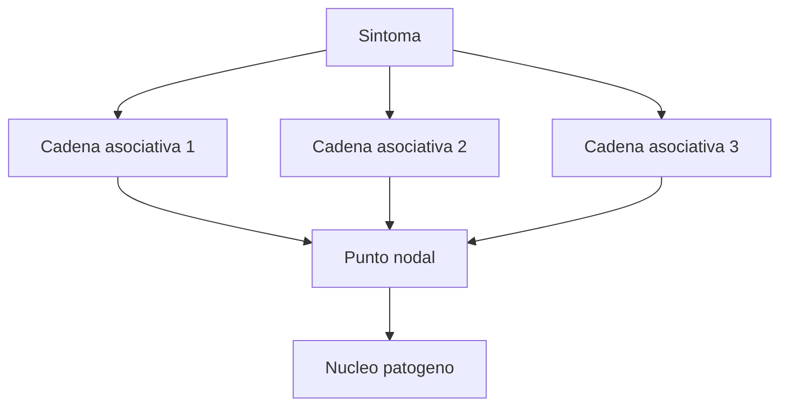

Sobredeterminacion:

- Un sintoma no tiene una unica causa ni un unico sentido.
- Distintas cadenas asociativas confluyen en puntos nodales.
- En Elisabeth von R. aparece un elemento que se repite en el lenguaje desde distintas cadenas.
- El sintoma no puede tratarse como cuerpo extrano que se extirpa: esta infiltrado en la trama psiquica.

#### Caso guia: Elisabeth von R.

Funcion del caso:

- Referente clinico para sintoma histerico, resistencia, simbolizacion, ordenamientos del material psiquico y sobredeterminacion.
- No conviene leerlo como caso de vivencia sexual prematura traumática: sirve para situar conflicto psíquico irreconciliable en un momento anterior de la teoría.

Sintomas:

- Dolores en las piernas.
- Dolor impreciso.
- Dificultad para caminar.
- Caracter rebelde del sintoma.
- Durante masajes, chillidos o reaccion tipo cosquilla en una zona histerogena.
- La pierna empieza a entrometerse en el analisis.

Historia familiar y escenas iniciales:

- Hija menor de tres hermanas.
- El padre esperaba un hijo varon; ella queda ubicada en cierto lugar de hija-varon.
- Formacion intelectual.
- El padre no espera que ella arme una vida fuera de el.
- El padre enferma y Elisabeth lo cuida.
- Muere el padre.
- Luego enferma la madre, viuda y sola; cirugia ocular, Elisabeth la cuida.
- Una hermana se casa y se muda lejos; Elisabeth odia al cunado por alejarla.
- Otra hermana se casa y queda cerca; ese cunado le cae bien.
- Cuando la madre mejora, hacen un viaje de distension familiar.
- Elisabeth enferma: pasa de enfermera a enferma de la familia.
- Luego muere la segunda hermana al tener su segundo hijo; el marido se siente culpable y se aleja de la familia.

Tratamiento con Freud:

- No puede hipnotizarla.
- Los primeros recuerdos que aparecen son mas superficiales.
- Freud sigue el sintoma, las resistencias y las asociaciones.
- La pregunta no es solo "que paso", sino como se enlazan escenas, palabras, posiciones corporales y afectos.

Primer registro del dolor:

- Mientras el padre estaba enfermo, Elisabeth tuvo una cita.
- Pensaba que con ese hombre podria casarse.
- Ese mismo dia el padre estaba muy mal, con ataque al corazon.
- Ella no vuelve a ver al joven.
- Ahi aparece el primer registro del dolor en la pierna.
- Todavia no estalla el sintoma completo, pero se arma una primera articulacion del conflicto psiquico.

Por que la pierna:

- Freud pregunta por que el dolor se localiza en esa pierna.
- El padre apoyaba su pierna sobre ella durante los cuidados.
- El cuerpo queda tomado por una referencia simbolica ligada al cuidado del padre.

Agrupamiento de escenas por posicion corporal y significante:

| Serie | Escenas / asociaciones | Funcion |
|---|---|---|
| Stehen: estar de pie, estar parada | Cuando traen al padre luego del ataque cardiaco; terror estando de pie; velorio de la hermana | Detencion, quedar petrificada, quedar detenida en la vida |
| Gehen: andar, caminar | Dificultad para caminar, desplazamientos, paseos | Movimiento impedido, avance obstaculizado |
| Alleinstehen: estar sola, sostenerse sola, ser independiente | Dolor por su soledad; declaracion de no necesitar compania masculina; paseo con el cunado donde advierte la felicidad de la hermana | Soledad, independencia, deseo de otra vida |

Diagrama de sobredeterminacion:

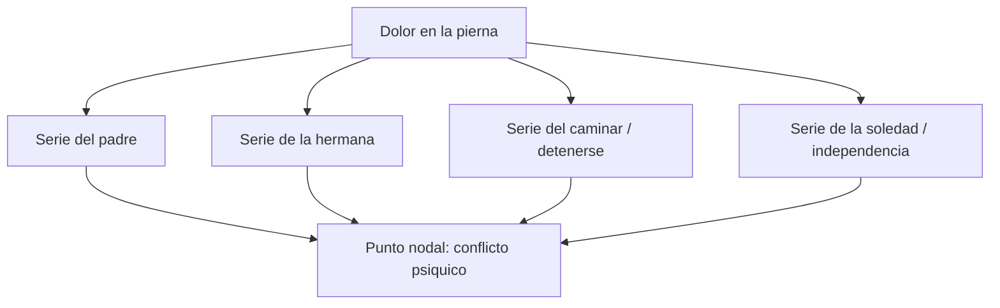

Advertencia de clase:

- La profesora marco que Freud comete un error si adjudica el conflicto simplemente a que Elisabeth estaba enamorada del cunado.
- Ese no seria el conflicto principal a retener para la catedra.

Conflicto psiquico a formular:

- Incompatibilidad entre querer ser amada, amar y pensarse como mujer, por un lado, y tener que cuidar al padre ocupando el lugar de hijo, por otro.
- El conflicto no es meramente "amor por el cunado"; es la imposibilidad de tramitar una posicion deseante propia frente a los mandatos familiares y el lugar de cuidadora.

Formula breve:

- En Elisabeth, el sintoma en la pierna no tiene un unico sentido: condensa varias series asociativas.
- La pierna duele como cuerpo simbolico: el lenguaje y la historia toman el cuerpo.
- El caso permite mostrar que el sintoma esta sobredeterminado y que el material no se extirpa como un cuerpo extrano, sino que se recorre por cadenas.

### Teóricos - 1900: sueño y primera teoría del psiquismo

Texto central:

- La interpretacion de los sueños.

Orientacion de la clase:

- En teóricos no se trabaja el sueño solo como fenómeno clínico, sino como vía para construir una primera teoría del psiquismo.
- Con Psicopatologia de la vida cotidiana y La interpretacion de los sueños, Freud extiende la escision psiquica mas alla de la histeria y la neurosis.
- Premisa: para todos existe una parte de la vida psiquica accesible solo por formaciones como sueños, chistes, lapsus, olvidos y errores.

Cambio freudiano:

| Antes | Desde las formaciones del inconciente |
|---|---|
| La escision de conciencia aparece ligada a histeria o neurosis | La division psiquica concierne a todos |
| El sintoma es la via privilegiada | Sueños, chistes, lapsus y olvidos tambien tienen sentido |
| El inconciente aparece como grupo psiquico segundo | El inconciente se piensa como sistema con reglas propias |

Hipotesis:

- Los productos psiquicos aparentemente absurdos tienen sentido.
- Los sueños son prueba de la existencia del inconciente.
- El inconciente es un sistema: tiene reglas, legalidad y funcionamiento propio.
- El inconciente es constitutivo del psiquismo e irreductible: no se elimina.
- Contra la equivalencia de epoca entre psiquismo y conciencia, Freud sostiene que el sueño es psiquico, no meramente fisiologico.

Sueño para el psicoanalisis:

- El objeto de analisis es el relato del sueño.
- El sueño es una formacion de texto: palabras, enlaces, asociaciones, sustituciones.
- Se diferencia del sintoma por su menor estabilidad temporal y porque no necesariamente trae padecimiento.
- Formula clasica: el sueño es la via regia al inconciente.

Caracteristicas del sueño:

1. Aparece en tiempo presente.
2. Se vive como vivencia real.
3. Tiene caracter alucinatorio.
4. Cumple una funcion: preservar el dormir.
5. Su fuerza impulsora es un deseo.

Fechner y las localidades psiquicas:

- Freud toma la idea de "localidades psiquicas".
- No son lugares anatomicos, sino lugares virtuales del aparato.
- El sueño ocurre en otro escenario.

#### Modelo reflejo y aparato psiquico

Punto importante:

- Freud parte de un modelo de arco reflejo: estimulo -> polo perceptivo -> polo motor -> descarga.
- Sobre ese modelo construye una hipotesis de aparato psiquico.

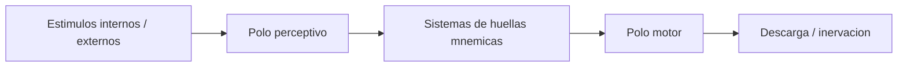

Dos coordenadas:

| Coordenada | Idea |
|---|---|
| Espacialidad fija | Los sistemas se ordenan en una secuencia estable dentro del modelo: percepcion, huellas, sistemas psiquicos, motilidad |
| Temporalidad variable | La excitacion puede recorrer el aparato en direcciones distintas; segun el recorrido, cambia la temporalidad psiquica |

Direccion de la excitacion:

- Direccion progrediente: del polo perceptivo hacia el polo motor.
- Direccion regrediente: retorno hacia sistemas anteriores y hacia huellas cercanas a la percepcion.

#### Percepcion, memoria y huella mnemica

Primera diferenciacion:

- La excitacion que entra por el polo perceptivo deja una huella mnemica.
- La huella mnemica no es una copia con contenido, sino una alteracion permanente en los elementos de un sistema.

Definicion para memorizar:

- Huella mnemica: alteracion permanente sobrevenida a los elementos de un sistema.

Problema:

- Freud se pregunta si percepcion y memoria pueden pertenecer a un mismo sistema.
- Respuesta: no. Percepcion y memoria se excluyen mutuamente.
- Articulacion posterior: La pizarra magica ayuda a pensar esta imposibilidad de un unico sistema.

Cuadro:

| Sistema | Funcion |
|---|---|
| Percepcion | Recibir estimulos; no conserva huellas permanentes |
| Memoria | Conservar alteraciones permanentes; no percibe directamente |

Memoria y recuerdo:

- Memoria no equivale a recuerdo conciente.
- La memoria se constituye como sistema de huellas.
- El recuerdo ya implica una forma de actualizacion o reconstruccion.
- Freud ubica la conciencia del lado de la percepcion, no de la memoria.
- Formula de clase: la conciencia surge en reemplazo de la memoria.

Asociacion entre huellas:

| Tipo de asociacion | Idea |
|---|---|
| Simultaneidad | Huellas enlazadas por haber ocurrido juntas |
| Similitud | Huellas enlazadas por semejanza |
| Contiguidad | Huellas enlazadas por proximidad |

Consecuencia:

- Si dos huellas estan asociadas, la excitacion tiene facilitado el paso de una a otra.
- Las asociaciones pueden aparecer como delirantes o absurdas para el yo porque no siguen necesariamente la logica conciente.
- Tambien pueden ser dinamicas: dependen del contexto y de recorridos asociativos singulares.

#### Instancias y formacion del sueño

Esquema de instancias:

- Instancia criticadora.
- Instancia criticada.
- De su relacion, alteracion y compromiso surge el sueño.

Nota de orientacion:

- En tus notas aparece la duda de ubicacion exacta entre Icc/Prcc. Para no fijar mal el punto: conservar la idea central de que hay una instancia que censura y otra censurada, y que el sueño resulta de ese conflicto como formacion de compromiso.


Regla metapsicologica:

- Todos los procesos psiquicos comienzan en el inconciente.
- Algunos pueden llegar a la conciencia mediando por el preconciente.
- Los procesos de excitacion que surgen en el preconciente pueden acceder a la conciencia si la atencion se dirige hacia ellos.

#### Regresion y caracter alucinatorio

Problema:

- Freud quiere explicar por que el sueño se vive como percepcion y por que tiene caracter alucinatorio.

Hipotesis:

- Durante el dormir, el polo motor esta cerrado o disminuido.
- El deseo inconciente aporta fuerza al sueño.
- La excitacion no avanza hacia la descarga motriz; retorna en direccion regrediente.
- Al regresar, alcanza huellas cercanas al polo perceptivo.
- Esas huellas atraen la excitacion.
- Esto produce el caracter alucinatorio del sueño.

Diagrama:


Tipos de regresion:

| Tipo | Idea de trabajo |
|---|---|
| Topica | La excitacion vuelve hacia sistemas anteriores del aparato |
| Temporal | Retorno a lo infantil o fundante, no necesariamente a una infancia literal |
| Formal | Retorno a modos de figuracion y asociacion mas arcaicos: similitud, contiguidad, simultaneidad, imagen |

Formula importante:

- El sueño sustituye una escena infantil o fundante, constituida por huellas, junto con una escena actual.
- Lo infantil atrae la excitacion.
- "Infantil" no significa siempre recuerdo literal de infancia, sino lo fundante del aparato y del deseo.

#### Carta 52: sistemas y transcripciones

Orientacion de clase:

- No distraerse con la analogia neuronal.
- Importa como Freud articula los sistemas del aparato mediante transcripciones.

Esquema:

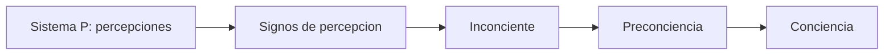

Sistemas:

| Sistema | Funcion / rasgo |
|---|---|
| Sistema P | Genera percepciones; se anuda a la conciencia; no deja huellas |
| Signos de percepcion | Primera transcripcion de la percepcion; insusceptibles de conciencia; articulados por simultaneidad; atraen excitacion |
| Inconciente | Segunda transcripcion; inasequible a la conciencia |
| Preconciencia | Tercera transcripcion; ligada a palabras; permite coherencia de relato |

Punto fino:

- Los signos de percepcion son huellas proximas al polo perceptivo.
- No conviene confundirlos directamente con el sistema Icc ya constituido.
- Su asociacion privilegiada es por simultaneidad.

#### Punto C del capitulo VII: deseo y vivencia de satisfaccion

Pregunta de Freud:

- Si el sueño nace del deseo inconciente, por que el inconciente aporta la fuerza para el sueño.
- Que clase de deseo es ese.
- De donde proviene.

Tres posibilidades de deseo:

| Tipo | Descripcion | Ubicacion orientativa |
|---|---|---|
| Deseo excitado durante el dia | Admitido, pero no tramitado; ejemplo: frutillas de Anna | Preconciente |
| Deseo surgido de dia y desestimado | No tramitado y sofocado | Preconciente -> inconciente |
| Deseo no diurno | No aparece durante el dia; proviene de lo sofocado | Mocion inconciente |

Mocion de deseo:

- No es un deseo particular con contenido pleno.
- Es movimiento, fuerza, empuje.
- No se llena definitivamente.
- No tiene representacion adecuada que lo agote.
- Es el deseo como motor, el unico capaz de crear sueños.

Apremio de la vida:

- Necesidades corporales internas.
- Tension de estimulos internos.
- El aparato no puede responderles como a un estimulo exterior.
- Ejemplo: el bebe con hambre llora, pero el llanto no satisface la necesidad.
- Los estimulos internos son continuos.
- No se puede huir de ellos.

Comparacion:

| Tipo de excitacion | Rasgo | Respuesta |
|---|---|---|
| Exterior | Momentanea | Se puede huir o descargar por accion |
| Interior | Permanente, fuerza constante | No se puede huir; exige trabajo psiquico |

Vivencia de satisfaccion:

- Se produce por la articulacion entre tension y objeto que calma.
- Lo que queda no es el objeto, sino huellas.
- Quedan al menos dos huellas asociadas por simultaneidad: tension y objeto.

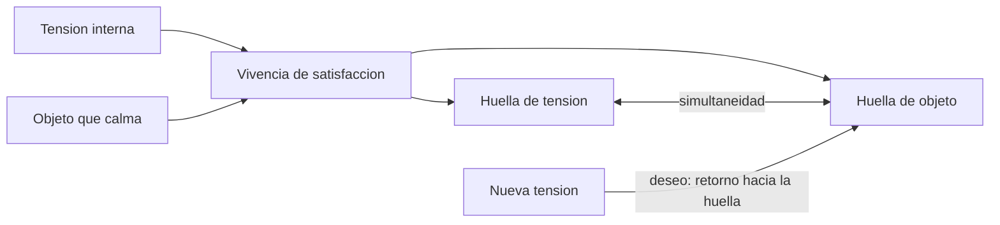

Definicion operativa de deseo:

- Cuando reaparece una tension, el aparato vuelve atraido hacia la huella del objeto que participo en la satisfaccion anterior.
- A esa fuerza de retorno se la llama deseo.
- El deseo busca revivir la vivencia de satisfaccion.
- Pero encuentra una huella, no el objeto.
- La diferencia entre lo que busca y lo que encuentra tambien constituye el deseo.
- Por eso el deseo es infinito o irreductible: nunca se revive plenamente la primera experiencia.

Formula:

- El deseo es la tendencia del displacer al placer.
- El deseo se sostiene en la diferencia entre objeto buscado, huella encontrada y satisfaccion imposible de repetir plenamente.

#### Proceso primario y proceso secundario

Punto clave:

- En el punto C, Freud usa el aparato construido en el punto B para explicar la naturaleza psiquica del desear.
- La vivencia de satisfaccion permite distinguir dos modos de funcionamiento.

Cuadro comparativo:

| Eje | Proceso primario | Proceso secundario |
|---|---|---|
| Sistema | Icc | Prcc/Cc |
| Aspira a | Identidad perceptiva | Identidad de pensamiento |
| Meta | Reproducir alucinatoriamente la vivencia de satisfaccion | Encontrar un objeto en la realidad mediante rodeos |
| Camino | Regrediente | Progrediente |
| Energia | Libre fluir, movilidad | Quiescente o ligada |
| Mecanismos | Condensacion y desplazamiento | Tanteo, inhibicion, pensamiento |
| Relacion con displacer | Busca descarga inmediata del displacer | Soporta algo de displacer para tramitar la necesidad |
| Resultado | Cumplimiento alucinatorio de deseo | Accion mediada, prueba, demora |

Proceso primario:

- Deseo regrediente.
- Busca la huella perceptiva de la vivencia de satisfaccion.
- Tiende a la identidad perceptiva.
- Opera con energia libre.
- Usa condensacion y desplazamiento.

Proceso secundario:

- Funcionamiento progrediente.
- Soporta una cuota de displacer.
- Busca satisfacer la necesidad mediante un objeto nuevo.
- Nunca reproduce exactamente la primera experiencia.
- Tiende a la identidad de pensamiento.

#### Principio de constancia y principio de placer

Punto importante:

- El principio de placer/displacer reemplaza o desplaza el principio de constancia como modelo suficiente.
- Con el deseo ya no alcanza pensar en simple descarga de tension.

Cuadro comparativo:

| Eje | Principio de constancia | Principio de placer/displacer |
|---|---|---|
| Modelo | Necesidad | Deseo |
| Problema | Aumento de tension | Tension ligada a huellas y satisfaccion perdida |
| Respuesta esperada | Accion especifica adecuada | Tramitacion psiquica de estimulos internos |
| Logica | Descargar / disminuir tension | Mantener la tension en umbrales, soportar displacer |
| Objeto | Objeto adecuado a la necesidad | Objeto buscado nunca coincide plenamente con la huella |
| Resultado | Descarga | Deseo como tension irreductible |

Formula para examen:

- El principio de constancia piensa un aparato que busca descargar tension.
- El principio de placer permite pensar un aparato movido por el deseo, donde la satisfaccion primera se pierde y solo retorna como huella.

### Practicos - Neuropsicosis de defensa, Emma, Manuscrito K y formaciones

Ubicacion temporal:

- 1893-1900: defensa, sintoma, trauma, formaciones del inconciente, primer aparato.
- 1900-1920: desarrollo metapsicologico posterior.
- 1920 en adelante: mas alla del principio de placer y segunda ordenacion.

Repaso inicial:

| Tema | Janet | Breuer | Charcot | Freud |
|---|---|---|---|---|
| Escision de conciencia | Primaria | Secundaria, ligada a estado hipnoide | Histeria de retencion / traumatica | Secundaria a la defensa |
| Tipo de histeria | Histeria por disociacion | Histeria hipnoide | Histeria de retencion | Histeria de defensa |

#### Las neuropsicosis de defensa

Texto:

- Las neuropsicosis de defensa, especialmente paginas 53, 59 y 61 segun notas de clase.

Esquema central:

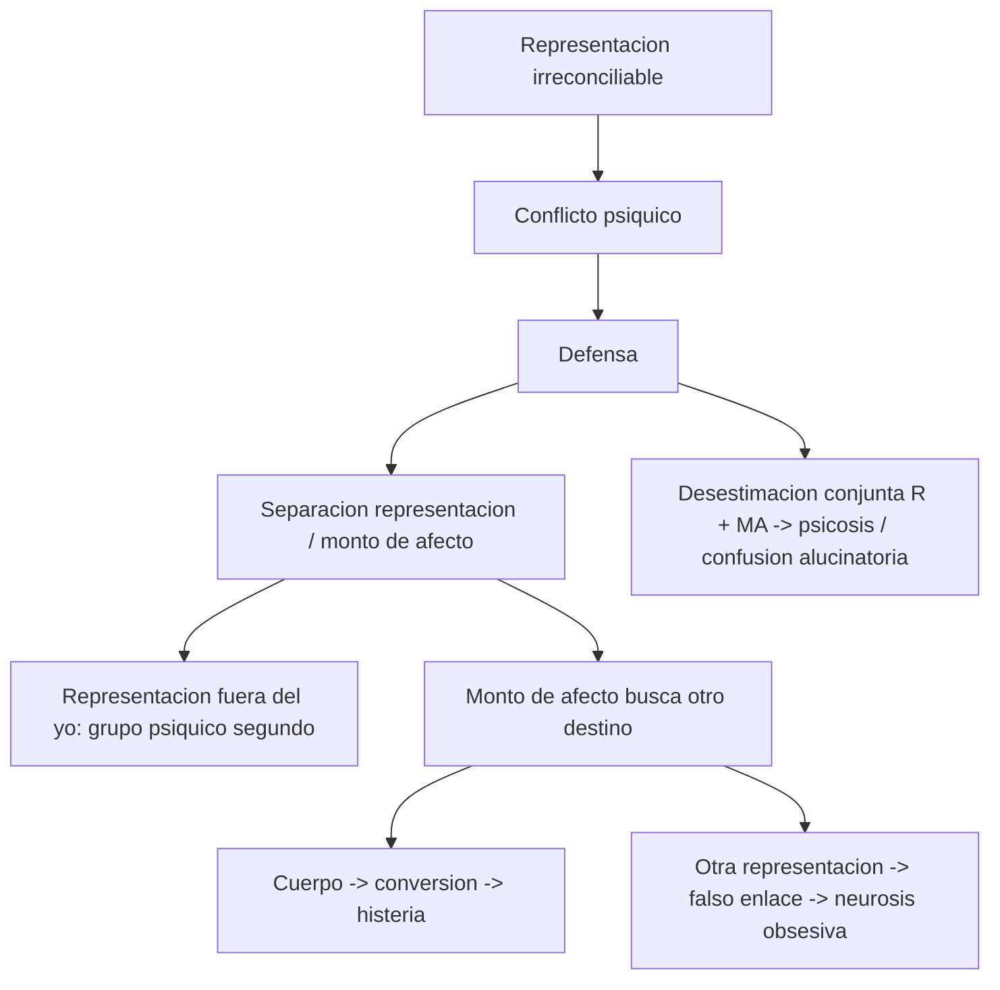

Hipotesis auxiliar:

- Freud supone que representacion y monto de afecto pueden separarse.
- El monto de afecto puede incrementarse, decrecer, desplazarse o transponerse.
- Esta hipotesis permite explicar sustitucion, desplazamiento, conversion y falso enlace.

Destinos:

| Defensa / destino | Operacion | Cuadro | Resultado |
|---|---|---|---|
| Conversion | El monto de afecto va al cuerpo | Histeria | Sintoma corporal |
| Falso enlace | El monto de afecto se adhiere a otra representacion | Neurosis obsesiva | Representacion obsesiva |
| Desestimacion conjunta | El yo expulsa representacion y afecto completos | Psicosis / confusion alucinatoria | Alucinacion, sin sintoma sustitutivo en sentido neurotico |

Sintoma:

- Es formacion sustitutiva de la representacion irreconciliable.
- El yo no sabe nada de la representacion original.
- El sintoma testimonia que la defensa fracaso parcialmente.

Nota de catedra:

- La psicosis aparece como tercer destino, pero luego la catedra no parece desarrollarla demasiado en este tramo.

#### Emma / Proton pseudos historica

Funcion del caso:

- Caso preparable para parcial.
- Permite explicar dos tiempos, eficacia postuma, diferencia entre vivencia y recuerdo, compulsión y determinismo.

Diagrama:

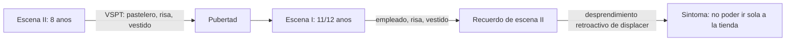

Puntos clave:

- La escena infantil no produce en su momento el afecto traumatico pleno.
- El recuerdo, despertado luego de la pubertad, genera el desprendimiento de displacer.
- Recuerdo no equivale a vivencia.
- La vivencia no tenia ese afecto en el momento; el recuerdo lo produce o lo incrementa a posteriori.
- Hay inversion de la temporalidad cronologica.
- La eficacia del trauma depende del encadenamiento de las dos escenas.

Efectos:

| Efecto | Idea |
|---|---|
| Retroaccion | Una escena posterior resignifica una anterior |
| Compulsion | El sintoma persiste y se repite |
| Determinismo | El sintoma queda determinado por la articulacion de ambas escenas |

Formula:

- En Emma, el sintoma no deriva de una escena aislada, sino de la articulacion retroactiva entre escenas.

#### Manuscrito K

Ejes:

- Defensa normal y defensa nociva.
- Eficacia postuma.
- Sexualidad e infantilismo.
- Fuente independiente de desprendimiento de displacer como antecedente de la pulsion.
- Formula canonica.

Cuadro:

| Tipo de defensa | Funcion | Resultado |
|---|---|---|
| Defensa normal | No vuelve a generar displacer nuevo | Puede ser inocua |
| Defensa nociva | Tiene eficacia postuma; genera displacer nuevo mas intenso | Produce represion y sintoma |

Formula canonica:


Doble dislocacion:

| Dislocacion | Idea para desarrollar |
|---|---|
| Temporal | El efecto aparece mas tarde, en algo presente |
| Analogica / sustitutiva | Otra vivencia funciona como subrogado por semejanza, enlace o sustitucion |

Esquema defensa-sintoma-resistencia:

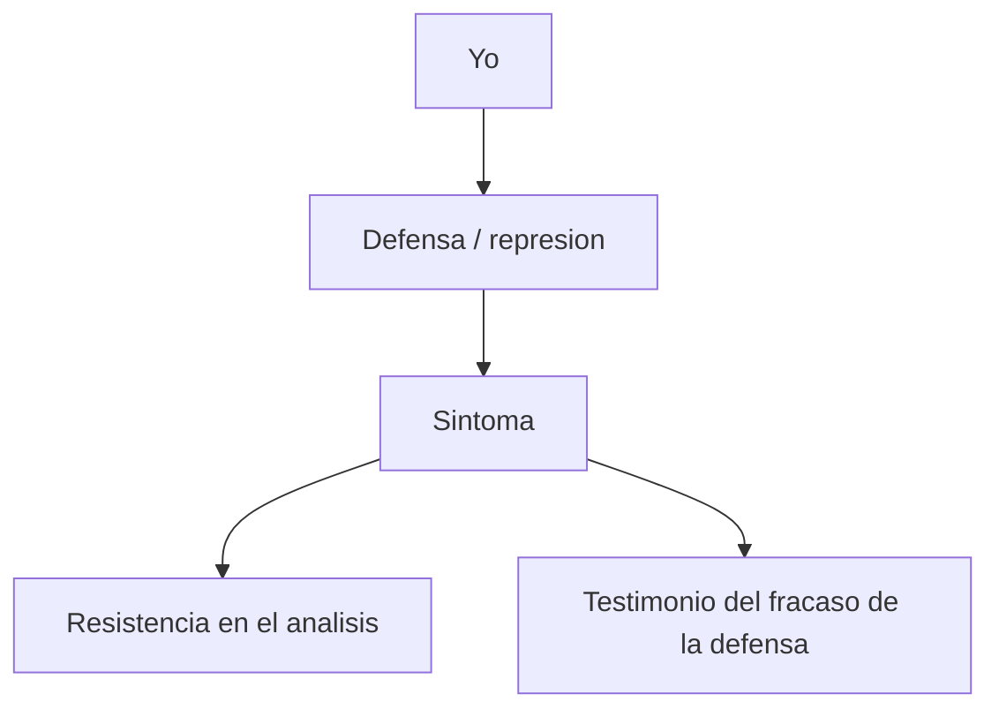

#### Chiste

Punto general:

- Condensacion y desplazamiento son mecanismos del inconciente.
- Aparecen en formaciones como chistes, sueños, sintomas, actos fallidos y lapsus.
- El nombre "formaciones del inconciente" es posterior, pero la catedra lo usa para leer estos fenomenos.

Chiste famillionario:

```text
famili | ar
milion | ar
-----------
famillionar
```

Tecnica:

- Condensacion con formacion sustitutiva.
- Como el sintoma, requiere reconstruccion.
- El efecto chistoso esta en la expresion verbal, no solo en el pensamiento.

Otros chistes importantes:

| Chiste | Mecanismo | Punto |
|---|---|---|
| Becerro de oro / "este ya no es tan joven" | Desplazamiento del acento | Se desplaza el valor simbolico |
| Pregunta del bano al judio | Desplazamiento y literalidad | "Tomar un bano" se lee literalmente |
| Profesor y alcohol | Doble sentido / desplazamiento | Juego con ambiguedad verbal |
| Casamentero | Desplazamiento + agudeza | Cambio de hilacion del pensamiento |

Definicion de desplazamiento:

- Desvio de la hilacion de pensamientos hacia otro pensamiento distinto del original.

Punto fino:

- En muchos chistes hay condensacion y desplazamiento combinados.
- Tambien puede pensarse un efecto de dos tiempos: el remate resignifica lo anterior.

#### Practicos - Aparato psiquico y sueño

Punto B de La interpretacion de los sueños:

- Represion.
- Figurabilidad en imagenes.
- Elaboracion secundaria.
- Desplazamiento.
- Condensacion.

Localidad psiquica:

- Lugar virtual del aparato, no localizacion anatomica.
- Permite pensar sistemas diferenciados y recorridos de excitacion.

Esquema general:

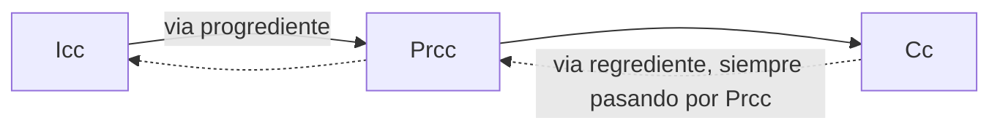

Huella mnemica:

- Alteracion permanente de un sistema.
- Memoria y percepcion deben ser sistemas distintos.
- Percepcion y memoria se excluyen como funciones.

Secuencia:

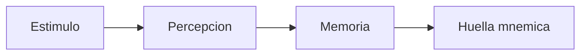

Asociacion de huellas:

- Simultaneidad.
- Semejanza.
- Contiguidad.

Esquema del peine:

- A diferencia del arco reflejo simple, incluye sistemas del aparato psiquico.
- Mantiene dos polos: perceptivo y motor.
- Del lado de la percepcion se ubican huellas mnemicas.
- El Icc es punto de partida para la formacion de sueños.
- Prcc se asocia a atencion y acceso posible a conciencia.

Formula:

```text
Icc (represion) -> Prcc (atencion) -> Cc
```

Sueño:

- Tiene caracter regrediente.
- Durante el dormir se cierra la motilidad.
- La excitacion no descarga hacia el polo motor y vuelve a circular.
- En el trabajo del sueño, montos y cantidades saltan libremente de representacion en representacion.
- Esa movilidad permite condensacion y desplazamiento.

Definicion orientativa:

- Cerrado el polo motor, escenas infantiles recombinadas con restos diurnos atraen la energia hacia atras.

Temas centrales de practicos:

- Arco reflejo: diagrama y explicacion.
- Esquema del peine: primera topica.
- Definicion de sueño.
- Vivencia de satisfaccion.
- Condensacion: varios elementos pasan a ser uno.
- Desplazamiento: lo nimio desplaza a lo importante.
- Relato del sueño: al narrar se filtra, ordena y pierde parte de la incoherencia; el analisis trabaja con el relato, no con una experiencia pura del sueño.

#### Practicos - Punto C y E: deseo, cumplimiento y procesos

Paginas marcadas:

- Punto C: acerca del cumplimiento de deseo, paginas 543 y 556-558.
- Paginas 545-546: sueño como sustituto de un deseo infantil asociado a lo actual diurno.
- Punto E: proceso primario, pagina 586.
- Vivencia de terror: pagina 589, a elaborar con cuidado.

Formula central:

- El sueño es sustituto de un deseo infantil asociado a lo actual diurno.

Rasgos del deseo:

| Rasgo | Idea |
|---|---|
| Infantil | Se enlaza con lo fundante del aparato, no necesariamente con una escena infantil literal |
| Inmortal | No se desgasta con el tiempo; insiste |
| Inconciente | No esta disponible para la conciencia |
| Reprimido | Solo retorna desfigurado, por formaciones sustitutivas |

Identidad de percepcion:

- Se arma sobre la primera necesidad y la huella de la primera satisfaccion.
- El aparato busca reinvestir esa primera experiencia de satisfaccion.
- La catedra lo nombra como "hambre de signo": busqueda de reencontrar una marca de satisfaccion.
- Pero la primera satisfaccion nunca se recupera plenamente.

Deseo:

- Es el resto de esa primera experiencia.
- Es lo que mueve al aparato.
- Nunca se satisface por completo.
- No es un contenido simple, sino mocion.

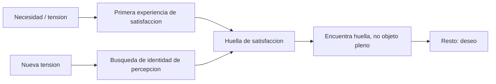

Proceso primario:

- Propio del Icc.
- Trabaja bajo el principio de placer.
- Opera con energia movil.
- Permite condensacion y desplazamiento.
- Busca identidad de percepcion.

Proceso secundario:

- Debe hacer un rodeo para alcanzar una satisfaccion posible.
- Rodeo significa demora, pensamiento, accion, prueba de realidad.
- Las investiduras quedan ligadas: la energia no circula libremente de una representacion a otra, sino que queda mas fijada, contenida o inhibida para permitir pensamiento y accion.
- Busca identidad de pensamiento.

Vivencia de terror:

- Punto a desarrollar con el texto a mano.
- Orientacion provisional: funciona como contrapunto de la vivencia de satisfaccion.
- Si una huella queda asociada a terror/displacer, el aparato evita reinvestirla.
- Esa evitacion ayuda a pensar inhibicion, defensa y el limite de una pura busqueda de placer.

Sueño y localidades:

| Elemento | Localidad orientativa |
|---|---|
| Contenido manifiesto | Cc, relato del soñante |
| Asociaciones / pensamientos oniricos latentes | Prcc |
| Deseo inconciente | Icc |
| Restos diurnos | Cc/Prcc |
| Censura onirica | Frontera / operacion entre sistemas |
| Ombligo del sueño | Punto no interpretable, limite de la asociacion |

Trabajo del sueño:

- Deseo inconciente + restos diurnos.
- Censura onirica.
- Condensacion.
- Desplazamiento.
- Figurabilidad.
- Elaboracion secundaria.

Energia movil:

- En el sueño, la energia no queda ligada establemente a una representacion.
- Puede pasar de una representacion a otra.
- Esta movilidad permite condensacion y desplazamiento.

Formula:

- El deseo es una corriente que va del displacer al placer.

Caso de las tres entradas de teatro:

- Contenido manifiesto: relato de las tres entradas / teatro.
- Restos diurnos: noticia de la amiga que se casa, referencias temporales y economicas.
- Desplazamiento: casarse / apresurarse queda sustituido por ir al teatro / gastar en entradas.
- Deseo inconciente: placer de ver.
- Lectura sexual infantil: teatro / obras remite al placer de ver y puede articularse con la vida sexual de los padres.

#### Nota puente: neuropsicosis de defensa

Aunque en la cursada pueda aparecer mas en practicos/seminario, conviene tener el esquema para articular con teóricos.

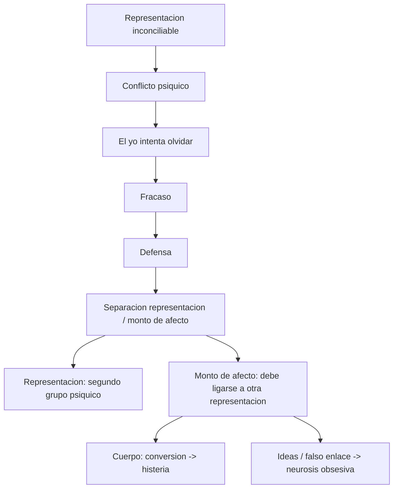

Comparacion rapida:

| Eje | Neurosis de defensa | Neurosis actuales |
|---|---|---|
| Mecanismo psiquico | Si | No |
| Campo de representaciones | Si | No |
| Recuerdos inconcientes | Si | No |
| Psicoanalisis inicial | Si opera | No opera del mismo modo |
| Logica economica | Representacion y monto de afecto | Cantidad de tension sexual |

### Seminario - Etiologia de la histeria y trauma

Problema general:

- No confundir antecedente con causa del sintoma.
- El trauma freudiano no se entiende como un choque mecanico al modo de Charcot, sino por su eficacia psiquica, simbolica y asociativa.
- En Freud el sintoma debe "hablar": hay algo en el lenguaje del paciente que permite hacer hablar al sintoma.
- La pregunta cambia historicamente:
  - 1893-1894: mecanismo psiquico, formacion de sintoma, terapeutica.
  - 1896: busqueda de la etiologia, es decir, de la causa.

Comparacion inicial:

| Eje | Charcot | Breuer/Freud inicial | Freud 1896 |
|---|---|---|---|
| Trauma | Modelo traumatico mas mecanico | Vivencia, afecto estrangulado, abreaccion | Eficacia postuma, sexualidad infantil, cooperacion de recuerdos |
| Metodo | Referencia a histeria traumatica | Hipnosis / metodo catartico | Reconstruccion de cadenas asociativas |
| Sintoma | Efecto del trauma | Afecto no abreaccionado | Formacion sobredeterminada por recuerdos inconcientes |

Distincion de bloque:

- Teorico: principio de constancia, afecto estrangulado, sintoma.
- Practico: defensa separa representacion y monto de afecto para explicar las neurosis.
- Seminario: etiologia, causa, determinismo, dos tiempos, cadena de nexos.

Punto central repetido en clase:

Para que una vivencia participe en la causa del sintoma hacen falta dos condiciones:

| Condicion | Funcion | Si aparece sola |
|---|---|---|
| Idoneidad determinadora | Aporta el nexo especifico con el sintoma | No alcanza porque puede faltarle fuerza |
| Fuerza traumatica | Aporta intensidad cuantitativa | No alcanza porque puede faltarle nexo determinador |

Modelo para diagramar:

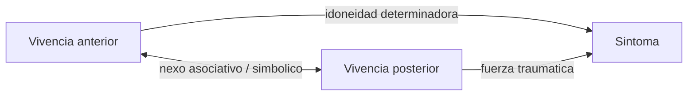

Ejemplo de clase:

- Accidente de tren y vivencia anterior del cadaver.
- El tren aporta fuerza traumatica, pero no necesariamente idoneidad.
- La vivencia anterior aporta idoneidad, pero no necesariamente fuerza.
- El sintoma se produce por la articulacion de ambas, no por una escena aislada.

Alerta conceptual:

- El nexo no siempre es por contenido manifiesto, sino por asociacion simbolica, tropo, lenguaje, nexo logico o asociacion extrinseca.
- La cadena tiene eslabones transitorios pero necesarios.
- La memoria falsea en el relato.
- El recuerdo genuino queda sustraido de la conciencia.
- Lo falseado es el enlace: el relato puede conservar elementos, pero equivocar la conexion causal.

Distincion importante:

| Termino | Para estudiar |
|---|---|
| Vivencia | Acontecimiento vivido, no necesariamente patogeno por si mismo |
| Recuerdo | Reinscripcion psiquica de la vivencia; puede volverse eficaz a posteriori |
| Recuerdo inconciente | Recuerdo sustraido de la conciencia que puede producir y sostener sintomas |
| Recuerdo encubridor | Recuerdo conservado por su enlace con otro reprimido; sustituto por desplazamiento |

Tesis de Etiologia de la histeria a desarrollar:

1. Ningun sintoma histerico surge de una unica vivencia real aislada.
2. El analisis conduce al ambito del vivenciar sexual.
3. Las escenas decisivas remiten a vivencias sexuales infantiles, anteriores a la pubertad, vividas en el cuerpo propio.
4. La vivencia no alcanza: debe ser despertada y conectada con otras.
5. El recuerdo inconciente, aun despertado por una vivencia posterior, permanece inconciente.
6. Hay sobredeterminacion: un sintoma tiene varios sentidos y un recuerdo puede enlazarse con varios sintomas.
7. La eficacia es postuma: el recuerdo cobra eficacia traumatica por la articulacion en dos tiempos.
8. El sintoma es formacion sustitutiva y formacion de compromiso.
9. La cooperacion de recuerdos es condicion de la causacion del sintoma.

Nota de precision:

- Emma y Elisabeth von R. conviene mantenerlas separadas.
- Emma: dos escenas, panaderia, risa, vestidos, temporalidad postuma.
- Elisabeth von R.: estratificacion del material psiquico y resistencia en Psicoterapia de la histeria.

Diagrama especifico para Emma:

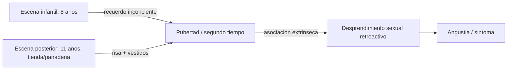

Formulas de examen:

- Sintoma como formacion sustitutiva: aparece en lugar del conflicto.
- Sintoma como formacion de compromiso: resulta de la defensa, pero conserva retorno de lo reprimido.
- El sintoma no se explica por una escena unica, sino por una cadena sobredeterminada.
- La temporalidad no es lineal: el segundo tiempo resignifica y vuelve eficaz al primero.

### Seminario - Psicopatologia de la vida cotidiana y formaciones del inconciente

Formaciones del inconciente a ubicar:

- Recuerdos encubridores.
- Chiste.
- Olvidos de nombres propios.
- Sueños.
- Errores.
- Lapsus.

Punto de orientacion:

- No son fenomenos patologicos en si mismos, sino normales.
- Funcionan como via de acceso a la logica del inconciente.
- Permiten ver en la vida cotidiana mecanismos ya trabajados en la histeria: desplazamiento, sustitucion, resistencia, sobredeterminacion y compromiso.

Cuadro temporal/conceptual:

```mermaid
flowchart LR
  A["Histeria"] --> B["Formaciones del inconciente"]
  B --> C["Primera teoria de la angustia"]

  A --> A1["Etiologia"]
  A --> A2["Cadena asociativa"]
  A --> A3["Sobredeterminacion"]
  A --> A4["Vivencia sexual infantil / recuerdo inconciente / cooperacion de recuerdos"]

  B --> B1["Recuerdos encubridores"]
  B --> B2["Sueños"]
  B --> B3["Olvidos"]
  B --> B4["Chiste"]
  B --> B5["Errores y lapsus"]
```

Problema paradojal:

- El recuerdo inconciente "esta" y produce efectos.
- Se hace presente por sus sustitutos.
- Puede desprender displacer.
- Pero al mismo tiempo permanece inconciente.
- La salida freudiana es pensar formaciones sustitutivas y de compromiso.

#### Recuerdos encubridores

Tesis:

- Los recuerdos encubridores deben su existencia a mecanismos de desplazamiento.
- No se conservan por su contenido propio, sino por su enlace asociativo con otras impresiones mas significativas.
- La memoria no es simple deposito ni desgaste natural: es selectiva, tendenciosa y trabaja con sustituciones.

Diagrama base:

```mermaid
flowchart LR
  A["Recuerdo reprimido / significativo"] -->|"tiende a salir"| C["Formacion de compromiso"]
  B["Resistencia"] -->|"estorba el acceso directo"| C
  C --> D["Recuerdo encubridor indiferente"]
  D -->|"analisis, asociaciones, puentes linguisticos"| A
```

Mecanismo:

- Un recuerdo significativo queda reprimido o sustraido de la conciencia.
- La resistencia impide su emergencia directa.
- La fuerza que tiende a hacerlo presente y la resistencia no se cancelan.
- El resultado es una formacion de compromiso.
- El acento psiquico se desplaza hacia un recuerdo aparentemente indiferente.

Conceptos para cuadro:

| Concepto | Funcion |
|---|---|
| Recuerdo significativo reprimido | Elemento al que no se accede directamente |
| Resistencia | Impide o estorba el acceso al recuerdo original |
| Desplazamiento | Mueve el acento psiquico hacia un elemento indiferente |
| Recuerdo encubridor | Sustituto consciente del recuerdo reprimido |
| Analisis | Reconstruye asociaciones, nexos logicos y puentes linguisticos |

Asociacion:

- Puede operar por nexos logicos.
- Puede operar por puentes linguisticos.
- Puede operar por asociaciones extrinsecas, es decir, conexiones que no dependen del sentido manifiesto principal sino de enlaces laterales, verbales, sonoros, circunstanciales o simbolicos.
- Esto permite articular recuerdos encubridores con Emma y con Signorelli.

Tipos de recuerdos encubridores:

- Atrasadores.
- Adelantadores.
- Simultaneos.

Nota: aparecen en Freud, pero segun tus notas no parecen el eje principal de la catedra.

Por que los recuerdos de infancia son encubridores:

- Hay muchas lagunas en los recuerdos infantiles.
- A menudo nos vemos a nosotros mismos desde afuera, como en una escena visual.
- No poseemos una huella mnemica real y directa de la infancia.
- Lo que llamamos recuerdo infantil es una elaboracion posterior.
- Esa elaboracion esta influida por experiencias posteriores.
- Por eso no se trata de una copia fiel de la vivencia, sino de una construccion postuma.

Ejemplo a desarrollar:

- Recuerdo infantil de Freud de la canasta abierta.
- Escena aparentemente infantil e indiferente.
- Articulacion con la ninera, la madre y el hermano.
- Funcion del analisis: pasar del recuerdo conservado al enlace reprimido que le da valor.

### Seminario - Primera versión de la teoría de la angustia

Problema general:

- La primera teoría de la angustia obliga a distinguir neurosis de defensa y neurosis actuales.
- La diferencia central es si hay o no mecanismo psiquico, representacion, recuerdo inconciente y represion.
- En las neurosis actuales no opera el dispositivo freudiano basado en recuerdos inconcientes, porque no esta en juego una representacion reprimida.

Cuadro principal:

| Eje | Neurosis de defensa | Neurosis actuales |
|---|---|---|
| Cuadros | Histeria, neurosis obsesiva | Neurastenia, neurosis de angustia |
| Mecanismo | Defensa | Acumulacion actual |
| Representacion | Si, representacion inconciliable | No esta en juego una representacion |
| Recuerdo inconciente | Si | No |
| Dos tiempos | Si, eficacia postuma | No |
| Represion | Participa | No participa |
| Desplazamiento | Si, representacion/afecto pueden separarse | No: hay acumulacion de excitacion |
| Causa | Psiquica, historica, sexual infantil | Actual, sexual, por falla en la descarga |
| Tratamiento freudiano | Tiene eficacia porque trabaja recuerdos y asociaciones | No alcanza, porque no hay material representacional reprimido |

Tesis de la primera teoría:

- La angustia surge por transposicion de tension sexual somatica acumulada.
- La excitacion sexual somatica no encuentra tramitacion psiquica suficiente.
- Al no enlazarse con una representacion sexual o fantasia, no puede descargarse por la via esperada.
- Esa tension acumulada se muda en angustia.

Secuencia conceptual:

```mermaid
flowchart LR
  A["Tension sexual somatica"] --> B["Umbral"]
  B -->|"logra enlace psiquico"| C["Libido / representacion sexual / fantasia"]
  C --> D["Descarga sexual"]
  B -->|"no logra enlace psiquico"| E["Acumulacion"]
  E --> F["Transposicion en angustia"]
```

Definiciones para examen:

- Angustia: afecto sin representacion, con manifestacion corporal o somatica.
- Libido: tension sexual considerada en su pasaje a lo psiquico.
- Neurosis de angustia: neurosis actual producida por acumulacion de excitacion sexual somatica no tramitada psiquicamente.

Distincion de cuerpos:

| Eje | Cuerpo en la histeria | Cuerpo en la angustia |
|---|---|---|
| Mediacion | Simbolica | Somatica, no mediada por representacion |
| Mecanismo | Conversion | Transposicion de tension sexual somatica |
| Relacion con lenguaje | El sintoma puede leerse como mensaje | La angustia no se reduce por interpretacion |
| Tratamiento | Asociacion, recuerdo, elaboracion | El tratamiento freudiano inicial no opera del mismo modo |

Formula breve:

- En la histeria, el cuerpo habla simbolicamente.
- En la angustia de la primera teoría, el cuerpo descarga una tensión no ligada psíquicamente.

### Seminario - Sueño como formacion del inconciente

Textos y referencias de clase:

- Conferencias 7, 9, 11, 14 y 15.
- Paginas 285-286: breves pero importantes.
- La interpretacion de los sueños, capitulo VII, punto B.

Punto de orientacion:

- En seminario se trabaja el sueño como formacion del inconciente.
- El sueño no se lee como simbolismo total ni como clave mistica universal.
- La interpretacion freudiana es elemento por elemento, por asociaciones del sonante.
- El codigo de traduccion pertenece al sonante, aunque no lo conozca concientemente.
- El metodo es la asociacion libre; donde aparecen resistencias se localiza la censura.

Diagrama general:

```mermaid
flowchart TD
  A["Sueño"] --> B["Acto psiquico de pleno derecho"]
  A --> C["Interpretable"]
  A --> D["Formacion del inconciente"]
  A --> E["Guardian del dormir"]
  A --> F["Sobredeterminado"]
  A --> G["Sustituto de material inconciente"]
  A --> H["Fuerza impulsora: deseo por cumplir"]
  A --> I["Extraneza / rareza"]
  I --> J["Condensacion"]
  I --> K["Desplazamiento"]
  I --> L["Miramiento por la figurabilidad"]
  I --> M["Elaboracion secundaria"]
  H --> N["Censura psiquica"]
  N --> I
```

Preguntas rectoras:

- Como se forma el sueño.
- Que operaciones intervienen.
- Sobre que material trabaja.
- Que funcion cumple.
- Que valor tiene para la vida animica.

#### Conferencia 7 - Contenido manifiesto del sueño

Reglas de interpretacion:

1. No hacer caso a lo que el sueño parece querer decir.
2. Evocar representaciones sustitutivas y asociaciones para cada elemento por separado.
3. Esperar a que lo inconciente se instale por si solo, sin censura.

Esquema de lectura:

```mermaid
flowchart LR
  A["Contenido manifiesto"] -->|"asociacion libre elemento por elemento"| B["Pensamientos oniricos latentes"]
  B -->|"desciframiento"| C["Deseo inconciente"]
  A -.-> D["Resistencia"]
  D -.-> E["Censura"]
```

Claves:

- El sueño es una experiencia alucinatoria.
- No es una pictografia simple.
- Es escritura en imagenes, comparable a jeroglificos.
- Importa el valor signante: el sentido depende de la lectura asociativa del sonante.
- Freud no busca un significado unico del sueño entero, sino una red de asociaciones.

Caso para articular: tres entradas por 1,50 florines.

Elementos a analizar:

- Restos diurnos: la amiga que se casa, tres meses menor.
- Platea vacia.
- 1,50 florines.
- Tres entradas.
- Referencias temporales: apresuramiento.
- Critica a la cunada por apurarse a gastar dinero.
- Desplazamiento: del casarse / apresurarse hacia ir al teatro.
- Falta ubicar el deseo: poder ver otras obras, o no haberse apresurado en la eleccion matrimonial.

Punto teorico:

- A veces se toma una parte por el todo: condensacion.
- Lo propio del sueño es la transposicion en imagenes.

#### Conferencia 9 - La censura onirica

Tesis:

- La funcion del sueño es preservar el dormir.
- Incorpora estimulos exteriores que podrian perturbar el dormir.
- Es producto del inconciente.
- Es sobredeterminado.
- Su genesis esta en el deseo inconciente como motor.
- Puede aparecer como absurdo por efecto de la desfiguracion.

Esquema:

```mermaid
flowchart LR
  A["Pensamientos censurados"] --> B["Censura onirica"]
  B --> C["Desfiguracion del sueño"]
  C --> D["Contenido manifiesto"]
  B -.-> E["Resistencia en el analisis"]
```

Tres modos de censura:

| Modo | Funcion |
|---|---|
| Omision | Algo queda directamente fuera del contenido manifiesto |
| Alusion | Lo censurado aparece indirectamente |
| Desplazamiento del acento psiquico | Lo importante aparece como secundario y lo secundario toma relieve |

Lo censurado:

- Lo reprochable.
- Lo etico o moralmente inadmisible.
- Lo ofensivo para el yo.
- Lo estilisticamente deformado o disfrazado.

Distincion sobre lo inconciente:

| Tipo | Idea |
|---|---|
| Inconciente temporal | Lo actualmente no conciente, pero susceptible de devenir conciente |
| Inconciente permanente | Lo no reconocido, articulable con ombligo del sueño y nucleo patogeno |

#### Conferencia 11 - El trabajo del sueño

Problema:

- La interpretacion va del contenido manifiesto a los pensamientos oniricos latentes.
- El trabajo del sueño opera en sentido inverso: transforma pensamientos latentes en contenido manifiesto.

Operaciones centrales:

| Operacion | Que hace |
|---|---|
| Condensacion | Varios pensamientos o elementos latentes confluyen en un elemento manifiesto |
| Desplazamiento | Se mueve el acento psiquico; lo importante aparece disfrazado o secundarizado |
| Transposicion en imagenes visuales | Los pensamientos se figuran como escena o imagen |
| Elaboracion secundaria | Ordena el material para darle apariencia de relato coherente |

Formula breve:

- Interpretar es desandar el trabajo del sueño.
- El trabajo del sueño no piensa: transforma, desfigura y figura.
- La rareza del sueño no es un defecto, es el efecto de sus operaciones.

Condiciones del trabajo del sueño:

1. Transposicion de un enunciado desiderativo a uno indicativo: de "ojala pudiera estar comiendo frutillas" a "estoy comiendo frutillas".
2. Transposicion de pensamientos a imagenes visuales: cumplimiento alucinatorio de deseo.
3. En adultos, desfiguracion.

Operaciones del trabajo del sueño:

| Operacion | Funcion | Relacion con censura |
|---|---|---|
| Condensacion | Muchos pensamientos latentes se reducen o confluyen en pocos elementos manifiestos | Da oscuridad al sueño, pero no es simplemente efecto de censura; es propia del trabajo del inconciente |
| Desplazamiento | Mueve el acento psiquico o produce alusiones | Es propia del inconciente, pero la censura la usa para desfigurar |
| Transposicion en imagenes visuales | Convierte pensamientos en escenas, imagenes o figuraciones plasticas | No todo pensamiento latente se transpone |
| Elaboracion secundaria | Da orden, fachada racional y conexiones al contenido manifiesto | Opera del lado del contenido manifiesto; no siempre esta |

Condensacion:

- Tambien aparece en el chiste.
- No es traduccion directa de un elemento latente a un elemento manifiesto.
- Siempre esta presente en el sueño porque no hay traduccion uno a uno.
- Los pensamientos latentes se "achican" en el contenido manifiesto.

Modos:

| Modo | Idea |
|---|---|
| Omision | Algunos elementos latentes no aparecen directamente |
| Fragmentacion | Aparece una parte o fragmento en lugar de una totalidad |
| Fusion | Varios elementos se conectan por algo comun; personas mixtas, formaciones mixtas, famillionario |

Desplazamiento:

- Tambien aparece en el olvido de nombres, como Signorelli.
- Modos principales: descentramiento del acento psiquico y alusion.
- Puede apoyarse en asociaciones extrinsecas o foneticas, sin depender del sentido manifiesto.
- Asociacion extrinseca: enlace por fuera del sentido principal, por sonido, palabra, detalle lateral o puente verbal.
- Ejemplos: Signorelli, chiste del baño.

Transposicion de pensamientos en imagenes visuales:

- Es propia del sueño, pero no afecta a todos los pensamientos latentes.
- Ejemplo de limite: en "Padre, no ves que estoy ardiendo", una voz puede pasar como dicho.

Modos:

| Modo | Ejemplo / idea |
|---|---|
| Figuracion plastica de palabras | Sol + dado = soldado |
| Juego de lenguaje | Si una palabra contiene otra asociacion, puede figurarla como imagen |
| Escritura en imagenes | Para ideas mas complejas, el sueño funciona como jeroglifico, no como pictografia |

Elaboracion secundaria:

- Agrega conexiones.
- Da orden al sueño.
- Le produce una fachada racional.
- No esta siempre.
- Pertenece al lado del contenido manifiesto.

Advertencias para interpretar:

- El sueño es via regia de acceso al inconciente por asociacion libre.
- Siempre hay censura.
- El sueño opera en via regrediente.
- En el inconciente no hay oposicion ni negacion en sentido logico conciente.
- Interpretamos el contenido manifiesto mediante asociaciones.
- No hay que sobrestimar el trabajo del sueño: algunos elementos, criticas, dichos o restos diurnos pueden pasar casi sin modificacion de pensamientos latentes a contenido manifiesto.
- Estos mecanismos importan porque son paradigmaticos de la formacion del sintoma neurotico.

#### Localidades psiquicas en seminario

Cuadro orientador:

| Sistema | Elementos asociados |
|---|---|
| Icc | Deseo inconciente, ombligo del sueño |
| Pcc | Restos diurnos, pensamientos latentes, anhelos, deseo preconciente de dormir |
| Cc | Contenido manifiesto, asociaciones libres |

Punto fino:

- Deseo inconciente no equivale a anhelo.
- Pensamiento latente no equivale a deseo inconciente.
- Los restos diurnos pueden parecer sin importancia, pero formar nexos psiquicos con contenidos inconcientes.

#### Conferencia 14 - Cumplimiento de deseo

Restos diurnos:

- Parecen sin importancia.
- Por eso la censura puede no afectarlos directamente.
- Pueden formar nexos psiquicos con otros contenidos.
- Asi funcionan como estimulos desencadenantes del sueño.
- Cobran importancia por su articulacion, no por su valor manifiesto.

Deseo inconciente:

- Es el motor del sueño.
- Es inconciente, infantil y sexual.
- Se disfraza porque resulta prohibido.
- No equivale al anhelo ni al pensamiento latente.
- Freud lo compara con el socio capitalista: aporta la fuerza para que el sueño se produzca.

## Arquitectura general propuesta

```mermaid
flowchart TD
  A["Primer parcial"] --> B["Parte I - Mapa de cursada y examen"]
  A --> C["Parte II - Guia 1: defensa, histeria y formaciones del inconciente"]
  A --> D["Parte III - Guia 2: sueños y aparato psiquico"]
  A --> E["Parte IV - Comparadores transversales"]
  A --> F["Parte V - Banco de respuestas desarrolladas"]

  B --> B1["Que entra por teorico, practico y seminario"]
  B --> B2["Como reconocer que pregunta estan haciendo"]

  C --> C1["Histeria, defensa y trauma"]
  C --> C2["Metodo catartico, resistencia y transferencia inicial"]
  C --> C3["Emma, Manuscrito K y dos tiempos"]
  C --> C4["Formaciones del inconciente: olvido y chiste"]

  D --> D1["Aparato psiquico"]
  D --> D2["Vivencia de satisfaccion y deseo"]
  D --> D3["Proceso primario y secundario"]
  D --> D4["Trabajo del sueño"]
  D --> D5["Referentes clinicos de sueños"]

  E --> E1["Tablas de diferencia"]
  E --> E2["Lineas cronologicas conceptuales"]
  E --> E3["Diagramas de entidades y relaciones"]

  F --> F1["Modelos de respuesta por bloque"]
  F --> F2["Preguntas tramposas o bifurcadas"]
```

## Indice rector

### 0. Como usar este libro

- Lectura por bloque: teorico, practico, seminario.
- Lectura por problema: trauma, aparato, deseo, sueño, chiste, sintoma.
- Lectura por tipo de pregunta: definir, comparar, articular, ejemplificar.

### 1. Mapa del primer parcial

Objetivo: orientar que pertenece a cada espacio de cursada y que tipo de pregunta puede salir.

Cuadros necesarios:

- Matriz texto / bloque / concepto / ejemplo clinico.
- Lista de temas "solo teorico".
- Lista de temas "tipicamente practico".
- Lista de referentes clinicos y que concepto ejemplifica cada uno.

### 2. Guía 1 - Defensa, histeria, formaciones del inconsciente y primera teoría de la angustia

Fuente: `guias-de-lectura/guia1_modulo1.doc`.

#### 2.1 Teoricos: descubrimiento, histeria y defensa

Textos centrales:

- Sobre el mecanismo psiquico de los fenomenos histericos.
- Psicoterapia de la histeria.

Ejes:

- De Charcot a Freud: histeria traumatica e histeria comun.
- Trauma psiquico, referencia simbolica y determinacion del sintoma.
- Sintoma como expresion corporal de un estado psiquico.
- Principio de constancia: empequenecer la suma de excitacion.
- Metodo catartico y sus limites.
- Presion sobre la frente y aparicion de la resistencia.
- Pasaje de histeria comun a histeria de defensa.
- Conflicto psiquico y defensa.
- Sobredeterminacion del sintoma.
- Resistencia de asociacion y resistencia radial.
- Transferencia por enlace falso.
- Estratificacion del material patogeno.
- Referente clinico: Elisabeth von R.

Diagrama clave: estratificacion del material patogeno.

```mermaid
flowchart LR
  A["Material patologico"] --> B["Orden cronologico lineal"]
  A --> C["Estratos concentricos de resistencia"]
  A --> D["Hilos logicos hacia el nucleo"]
  C --> E["Nucleo patogeno"]
  D --> E
```

Cuadros a construir:

- Histeria traumatica vs histeria comun.
- Histeria de retencion / hipnoide / defensa.
- Resistencia de asociacion vs resistencia radial.
- Ordenamiento cronologico vs concentrico vs logico.

#### 2.2 Seminarios: etiologia, recuerdos encubridores y primera angustia

Textos centrales:

- Etiologia de la histeria.
- Recuerdos encubridores.
- Primera teoría de la angustia.

Ejes:

- Causacion del sintoma: del sintoma a su causa.
- Vivencias de eficacia traumatica.
- Idoneidad determinadora y fuerza traumatica.
- Cooperacion de recuerdos.
- Eficacia postuma.
- Condicion psicologica del sintoma: escenas como recuerdos inconcientes.
- Condicion etiologica: vivenciar sexual infantil.
- Conflicto psiquico y defensa.
- Recuerdo encubridor como sustituto por desplazamiento.
- Memoria tendenciosa.
- Primera teoría de la angustia: tensión sexual somática acumulada que no logra ligadura psíquica y se transpone en angustia.

Cuadros a construir:

- Condicion psicologica vs condicion etiologica.
- Recuerdo traumatico vs recuerdo encubridor.
- Angustia de primera teoría vs angustia ligada a represión en desarrollos posteriores.

#### 2.3 Practicos: defensa, Emma, Manuscrito K, olvido y chiste

Textos centrales:

- Las neuropsicosis de defensa.
- Proton pseudos historica: Emma.
- Manuscrito K.
- Nuevas puntualizaciones sobre las neuropsicosis de defensa.
- Cacilie M.
- El olvido de nombres propios.
- La tecnica del chiste.

Ejes:

- La escision de conciencia como consecuencia de la defensa.
- Representacion inconciliable, divorcio entre representacion y afecto.
- Grupo psiquico segundo como antecedente conceptual del inconciente.
- Conversion: afecto transpuesto a una representacion corporal.
- Representacion obsesiva: falso enlace.
- Rechazo conjunto en la psicosis.
- Hipotesis auxiliar: separacion entre representacion y afecto.
- Emma: temporalidad del trauma, dos escenas, eficacia postuma.
- Manuscrito K: defensa normal y defensa nociva.
- Fuente independiente de desprendimiento de displacer como antecedente de la pulsion.
- Formula canonica: defensa, retorno de lo reprimido, formacion de sintoma.
- Cacilie M.: conversion por simbolizacion y puentes verbales.
- Signorelli: olvido como formacion del inconciente, sustitucion por desplazamiento, sobredeterminacion.
- Chiste: tecnica, condensacion con formacion sustitutiva, palabra mixta "famillionario".

Cuadros a construir:

- Trauma histerico vs trauma en dos tiempos.
- Defensa vs represion.
- Defensa normal vs defensa nociva.
- Conversion vs representacion obsesiva vs rechazo psicotico.
- Recuerdo patogeno, simbolizacion, falso enlace, resistencia.
- Estratificacion del material psiquico en Elisabeth von R.
- Olvido de nombre propio vs chiste como formaciones del inconciente.

### 3. Guia 2 - Sueños y aparato psiquico

Fuente: Guia 2, modulo "Sueños y aparato psiquico".

#### 3.1 Teoricos: primera ordenacion metapsicologica

Textos centrales:

- La interpretacion de los sueños, capitulo VII, puntos B, C y E.
- Carta 52.

Ejes:

- Construccion del aparato desde el arco reflejo.
- Percepcion, memoria, huella mnemica y asociacion.
- Camino progrediente y regrediente.
- El otro escenario.
- Caracter alucinatorio del sueño.
- Vivencia de satisfaccion.
- Deseo como busqueda de identidad perceptiva perdida.
- Pensar como rodeo e inhibicion de la regresion.
- Proceso primario y proceso secundario.
- Principio de placer y principio de constancia.
- Carta 52: percepcion, signo perceptivo, inconsciente, preconsciente, conciencia.
- Represion como denegacion de traduccion.

Diagramas necesarios:

- Del arco reflejo al aparato psiquico.
- Sistemas P, huellas, Icc, Prcc/Cc.
- Camino progrediente vs regrediente.
- Vivencia de satisfaccion -> deseo -> identidad perceptiva -> pensamiento.

#### 3.2 Practicos: aparato psiquico

Ejes:

- Sueño como acto psiquico de pleno derecho.
- Sueño como formacion del inconciente.
- Sueño como realizacion de deseo.
- Sueño como guardian del dormir.
- Trabajo del sueño: condensacion, desplazamiento, figurabilidad, elaboracion secundaria.
- Regresion.
- Proceso primario y secundario.
- Formaciones de compromiso: sueño, sintoma, lapsus, chiste.

Cuadro clave:

| Concepto | Sistema | Energia | Meta | Mecanismo | Resultado |
|---|---|---|---|---|---|
| Proceso primario | Icc | Movil | Identidad perceptiva | Condensacion y desplazamiento | Cumplimiento alucinatorio de deseo |
| Proceso secundario | Prcc/Cc | Quiescente o ligada | Identidad de pensamiento | Inhibicion, rodeo, motilidad | Pensamiento y aplazamiento |

#### 3.3 Seminarios: formaciones del inconciente, sueños

Textos centrales:

- La interpretacion de los sueños, capitulo VI: trabajo del sueño.
- Capitulo VII, punto A: olvido del sueño.
- Conferencias de introduccion al psicoanalisis.
- Conferencia 15.
- El interes por el psicoanalisis.

Ejes:

- Sueño como escritura jeroglifica.
- Contenido manifiesto vs pensamientos latentes.
- Condensacion.
- Desplazamiento.
- Medios de figuracion.
- Miramiento por la figurabilidad.
- Elaboracion secundaria.
- Ombligo del sueño.
- Censura.
- Restos diurnos.
- Deseo inconciente como motor del sueño.

Referentes clinicos:

- Padre, entonces, no ves que estoy ardiendo.
- Sueño del salmon ahumado.
- Sueño de las tres entradas de teatro.

### 4. Comparadores transversales

Estos capitulos deberian funcionar como "tablas de examen".

1. Principio de constancia vs principio de placer.
2. Anhelo vs deseo inconciente.
3. Contenido manifiesto vs pensamientos latentes.
4. Condensacion vs desplazamiento.
5. Figurabilidad vs elaboracion secundaria.
6. Proceso primario vs proceso secundario.
7. Regresion topica vs regresion formal vs regresion temporal, si aparece en la bibliografia de la catedra.
8. Sueño vs sintoma vs lapsus vs chiste.
9. Trauma histerico vs trauma en dos tiempos.
10. Teorico vs practico vs seminario: mismo texto, distinto uso.
11. Histeria traumatica vs histeria comun vs histeria de defensa.
12. Resistencia de asociacion vs resistencia radial.
13. Condensacion en el sueño vs condensacion en el chiste.
14. Sobredeterminacion del sintoma vs sobredeterminacion del olvido.
15. Primera teoría de la angustia vs angustia articulada a represión.

### 5. Banco de respuestas desarrolladas

Formato de cada respuesta:

1. Tesis inicial en 3-5 lineas.
2. Desarrollo conceptual ordenado.
3. Articulacion con texto freudiano.
4. Ejemplo clinico o ejemplo de chiste/sueño si corresponde.
5. Cierre que retome la pregunta.

Primeras respuestas a preparar:

- Construccion del aparato psiquico en el capitulo VII de La interpretacion de los sueños.
- Vivencia de satisfaccion y constitucion del deseo.
- Proceso primario y secundario.
- Trabajo del sueño: condensacion, desplazamiento, figurabilidad y elaboracion secundaria.
- Sueño como cumplimiento de deseo: salmon ahumado / tres entradas / padre ardiendo.
- Trauma: distinguir mecanismo psiquico y dos tiempos.
- Estratificacion del material psiquico en Elisabeth von R.
- Chiste: famillionaire y bano del judio.
- Olvido de Signorelli como formacion del inconciente.
- Emma y la temporalidad retroactiva del trauma.

## Modelo de ficha por concepto

Cada concepto deberia tener siempre la misma forma:

```text
Concepto:
Bloque:
Texto fuente:
Problema que resuelve:
Definicion corta:
Desarrollo:
Conceptos vecinos:
Diferenciar de:
Ejemplo clinico:
Posible pregunta de parcial:
Respuesta en 8-10 lineas:
```

## Proxima tarea sugerida

Completar una matriz maestra con tres columnas principales: teorico, practico y seminario, cruzando Guia 1 y Guia 2 con textos, conceptos, ejemplos clinicos y posibles preguntas de parcial.
