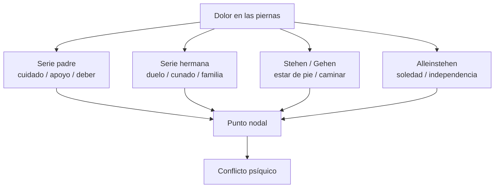

# Caso Elisabeth von R.

## Para que sirve

- Sobredeterminación del síntoma.
- Ordenamiento del material psíquico.
- Resistencia.
- Cuerpo simbolico.

## Raconto minimo

- Elisabeth cuida al padre enfermo y queda muy fijada a ese lugar.
- Tambien queda tomada por otras escenas: la hermana, los cunados, la soledad, el caminar, el estar de pie.
- El síntoma aparece como dolor en las piernas y dificultad para caminar.
- En el analisis, Freud no encuentra una sola causa: encuentra series asociativas que convergen.

## Series que convergen

| Serie | Escenas / significantes | Funcion |
|---|---|---|
| Padre | Cuidado, apoyo de la pierna, deber | Liga el síntoma al lugar de cuidadora |
| Hermana | Muerte, duelo, cunado | Introduce conflicto afectivo y familiar |
| Stehen | Estar de pie, quedar detenida | Marca petrificacion |
| Gehen | Caminar, desplazarse | Muestra movimiento impedido |
| Alleinstehen | Estar sola, sostenerse sola | Toca independencia y deseo propio |

## Diagrama

## Como lo lee Freud

- El síntoma no es un cuerpo extraño que se extirpa.
- El síntoma está infiltrado en la historia, el lenguaje y la posición subjetiva.
- Varias cadenas asociativas aportan un sentido parcial.
- El dolor en la pierna es un punto de convergencia.

## Lo que mas conviene decir en parcial

- Elisabeth no sirve para mostrar un "amor por el cuñado" como explicación única.
- Sirve para mostrar que el síntoma está sobredeterminado.
- Sirve para mostrar que el analisis avanza por hilos, resistencias y puntos nodales.

## Formula

*En Elisabeth, el síntoma no tiene un sentido único: varias series asociativas convergen en un mismo punto.*
