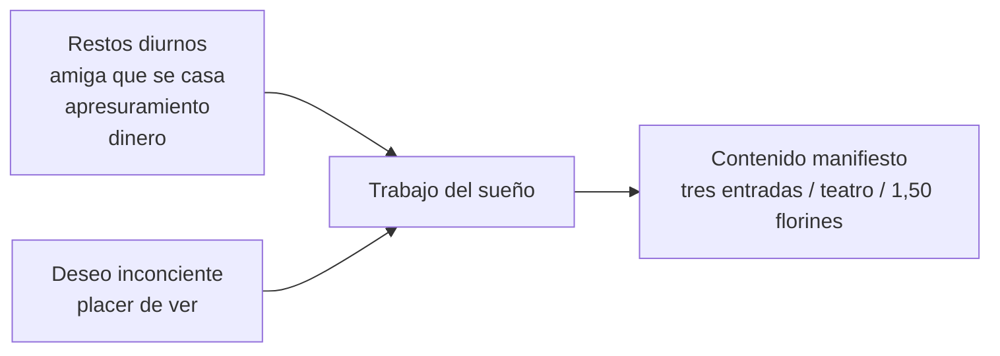

# Sueño de las tres entradas de teatro

## Para que sirve

- Trabajo del sueño.
- Restos diurnos.
- Desplazamiento.
- Figurabilidad.
- Articulacion entre deseo inconciente y contenido manifiesto.

## Raconto minimo

- El contenido manifiesto habla de entradas de teatro.
- Aparecen tres entradas, 1,50 florines, una platea vacia y referencias temporales.
- Entre los restos diurnos entra la noticia de una amiga mas joven que se casa.
- El sueño desplaza la cuestion del casarse o apurarse hacia la escena del teatro.

## Esquema

## Como leerlo

- No hay que traducir todo el sueño con un diccionario.
- El sueño condensa y desplaza.
- El teatro figura otra cuestion.
- El deseo inconciente no coincide sin mas con el anhelo manifiesto.

## Operaciones que conviene nombrar

| Operacion | En este caso |
|---|---|
| Desplazamiento | Del casarse / apurarse al teatro / gasto |
| Condensacion | Se reunen varias referencias temporales y economicas |
| Figurabilidad | El conflicto se vuelve escena visual |
| Elaboracion secundaria | El relato del sueño ya viene algo ordenado |

## Formula

*En las tres entradas, el sueño no dice de frente el conflicto: lo desplaza y lo vuelve escena.*
