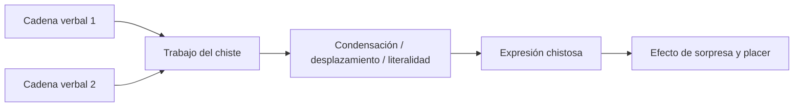

# Chistes

## Para que sirve

- Ver al inconciente trabajando en fenómenos normales.
- Distinguir técnicas de \concept{condensación}, desplazamiento, literalidad y doble sentido.
- Tener ejemplos breves y citables para parcial.

## Tesis mínima

*El chiste no es solo un pensamiento gracioso: es una operación de lenguaje donde varias cadenas se condensan, se desplazan o se reordenan para producir efecto.*

Freud se interesa por el chiste porque muestra que **el trabajo del inconciente también puede leerse en la palabra**, no solo en síntomas o sueños.

## Famillionario

```text
famili | ar
millon | ar
-----------
famillionario
```

### Qué muestra

- \concept{Condensación} con formación sustitutiva.
- Dos cadenas verbales convergen en una sola palabra mixta.
- El efecto no está solo en la idea, sino en la hechura verbal misma.

### Qué conviene decir

En `famillionario`, una palabra nueva concentra dos series:

- la de lo familiar;
- la del millonario.

No se trata de una mera suma. **La condensación produce un significante nuevo**, que conserva restos de ambas cadenas y hace trabajar juntas dos valoraciones.

## Baño del judío

### Qué muestra

- Literalidad.
- Desplazamiento.
- Cambio inesperado de la hilación del pensamiento.

### Qué conviene decir

El efecto aparece porque una expresión se toma en un registro no esperado. **El chiste fuerza una lectura literal o desplazada de una frase que en otro contexto sería entendida de modo más convencional.**

## Becerro de oro

### Qué muestra

- Desplazamiento del acento.
- Relectura de una fórmula conocida.
- Corrimiento del valor simbólico.

### Qué conviene decir

El trabajo del chiste no inventa desde cero: **reacomoda el acento** y hace que una expresión conocida opere en otro registro.

## Cuadro mínimo

| Chiste | Técnica dominante | Punto a retener |
|---|---|---|
| Famillionario | Condensación con formación sustitutiva | Palabra mixta |
| Baño del judío | Literalidad y desplazamiento | Cambio de lectura |
| Becerro de oro | Desplazamiento del acento | Reacomodo del valor |

## Diagrama de lectura



## Fórmula de parcial

*El chiste muestra que el inconciente trabaja con palabras: condensa series verbales, desplaza el acento o fuerza lecturas literales para producir un efecto que no depende solo del contenido, sino de la operación significante.*

## Error frecuente

- Tratar los ejemplos como si fueran simples “temas graciosos”.
- Nombrar solo la técnica sin mostrar cómo aparece en el caso.
- Olvidar que el interés freudiano está en el *trabajo de lenguaje*.
